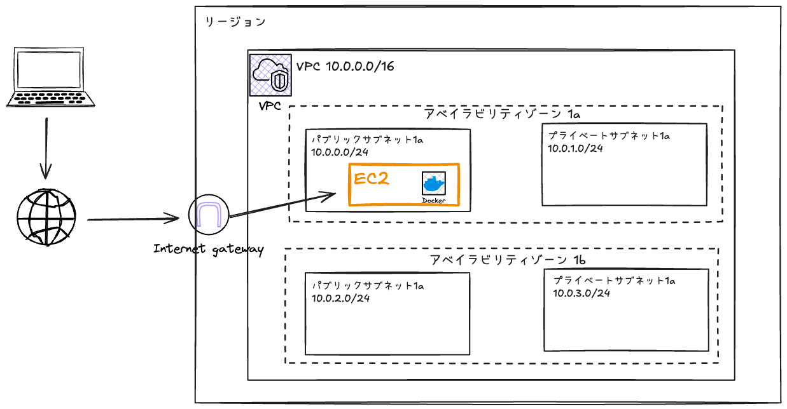
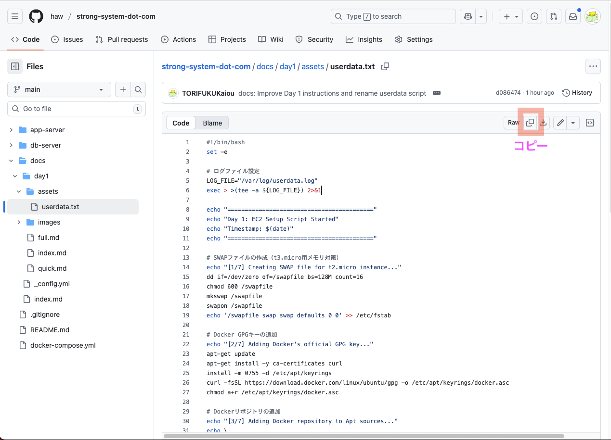
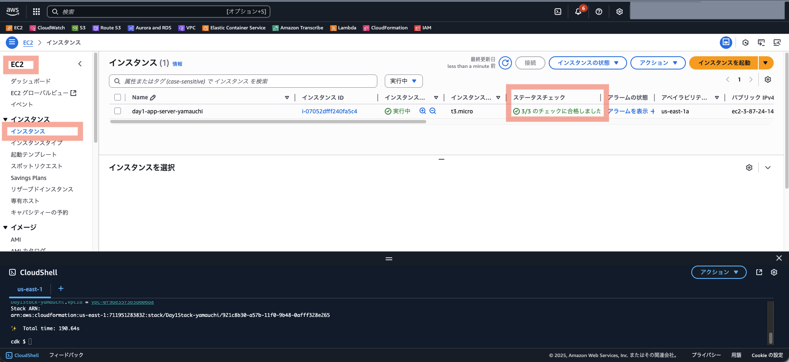

# Day 1: オンプレミス環境をクラウドへ

## 目標

DockerコンテナをEC2で動作させ、VPC、EC2、セキュリティグループの基本を理解する。

## 構成図



## 前提条件

- AWSアカウント
- AWSマネジメントコンソールへのアクセス権限

## 所要時間

約30分

## 重要: リソース名の命名規則

**すべてのリソース名に `-{あなたの名前}` を付けてください。**

例: `tanaka-day1-vpc`, `day1-app-sg-suzuki`, `day1-app-server-yamada`

共有AWSアカウントを使用するため、名前の重複を避ける必要があります。

---

## 手順

- リージョンは任意のリージョンでかまいませんが、無難に「東京リージョン」を選んでください

### 1. VPC作成

1. AWSマネジメントコンソールで **VPC** サービスを開く
2. **VPCを作成** ボタンをクリック
3. 以下の設定を入力：
    - **作成するリソース**: VPCなど
    - **名前タグ**: `{あなたの名前}-day1-vpc` (例: `tanaka-day1-vpc`) ※ `-vpc`は自動でサフィックスされるので、 `tanaka-day1` まで入力する
    - **IPv4 CIDR ブロック**: `10.0.0.0/16`
    - **IPv6 CIDR ブロック**: IPv6 CIDR ブロックなし
    - **テナンシー**: デフォルト
    - **アベイラビリティーゾーン (AZ) の数**: 2
    - **AZのカスタマイズ**: `1a`と`1c`
    - **パブリックサブネットの数**: 2
    - **プライベートサブネットの数**: 2
    - **サブネット CIDR ブロックをカスタマイズ**
        - **1aのパブリックサブネット CIDR ブロック**: 10.0.0.0/24
        - **1cのパブリックサブネット CIDR ブロック**: 10.0.1.0/24
        - **1aのプライベートサブネット CIDR ブロック**: 10.0.2.0/24
        - **1cのプライベートサブネット CIDR ブロック**: 10.0.3.0/24
    - **NATゲートウェイ**: なし
    - **VPCエンドポイント**: なし
5. **VPCを作成** ボタンをクリック
6. **DNSオプション** 下記にチェック
    - **DNS ホスト名を有効化**
    - **DNS 解決を有効化**

**作成されるリソース:**
- VPC (10.0.0.0/16)
- パブリックサブネット × 2 (10.0.0.0/24, 10.0.1.0/24)
- プライベートサブネット × 2 (10.0.2.0/24, 10.0.3.0/24)
- インターネットゲートウェイ
- ルートテーブル (パブリック用、プライベート用)

---

### 2. セキュリティグループ作成

1. AWSマネジメントコンソールで **EC2** サービスを開く
2. 左メニューから **セキュリティグループ** を選択
3. **セキュリティグループを作成** ボタンをクリック
4. 以下の設定を入力：
    - **セキュリティグループ名**: `day1-app-sg-{あなたの名前}` (例: `day1-app-sg-tanaka`)
    - **説明**: `Security group for Day 1 application`
    - **VPC**: `{あなたの名前}-day1-vpc` を選択

5. **インバウンドルール** を追加：

    | タイプ | プロトコル | ポート範囲 | ソース | 説明 |
    |--------|-----------|-----------|--------|------|
    | カスタムTCP | TCP | 3000 | Anywhere-IPv4 (0.0.0.0/0) | App Server 1 |
    | カスタムTCP | TCP | 3001 | Anywhere-IPv4 (0.0.0.0/0) | App Server 2 |
    | カスタムTCP | TCP | 9000 | Anywhere-IPv4 (0.0.0.0/0) | MinIO API |
    | カスタムTCP | TCP | 9001 | Anywhere-IPv4 (0.0.0.0/0) | MinIO Console |

6. **アウトバウンドルール**

    VPCを選択したときに下記の設定になっている。  

    | タイプ | プロトコル | ポート範囲 | 送信先 | 説明 |
    |--------|-----------|-----------|--------|------|
    | カスタムTCP | TCP | 3000 | Anywhere-IPv4 (0.0.0.0/0) |  |

7. **セキュリティグループを作成** ボタンをクリック

---

### 3. IAMロール作成

1. AWSマネジメントコンソールで **IAM** サービスを開く
2. 左メニューから **ロール** を選択
3. **ロールを作成** ボタンをクリック
4. **信頼されたエンティティタイプ**: AWSのサービス
5. **ユースケース**: EC2
6. **次へ** ボタンをクリック
7. ポリシーを検索: `AmazonSSMManagedInstanceCore`
8. チェックボックスを選択
9. **次へ** ボタンをクリック
10. **ロール名**: `day1-ec2-role-{あなたの名前}` (例: `day1-ec2-role-tanaka`)
11. **ロールを作成** ボタンをクリック

---

### 4. EC2インスタンス作成

1. AWSマネジメントコンソールで **EC2** サービスを開く
2. **インスタンスを起動** ボタンをクリック

    #### **基本設定**
    
    - **名前**: `day1-app-server-{あなたの名前}` (例: `day1-app-server-tanaka`)
    - **アプリケーションおよび OS イメージ (Amazon マシンイメージ)**: 
      - **クイックスタート**: Ubuntu
      - **Amazon マシンイメージ (AMI)**: Ubuntu Server 24.04 LTS (HVM), SSD Volume Type
      - **アーキテクチャ**: 64 ビット (x86)
    
    #### **インスタンスタイプ**
    
    - **インスタンスタイプ**: t3.micro
    
    #### **キーペア**
    
    - **キーペア名**: キーペアなしで続行
    
    #### **ネットワーク設定**
    
    「編集」ボタンを押して設定
    
    - **VPC**: `{あなたの名前}-day1-vpc`
    - **サブネット**: パブリックサブネット (10.0.0.0/24 または 10.0.1.0/24)
    - **パブリック IP の自動割り当て**: 有効化
    - **ファイアウォール (セキュリティグループ)**: 既存のセキュリティグループを選択
      - `day1-app-sg-{あなたの名前}` を選択
    
    #### **ストレージを設定**
    
    - **ルートボリューム**: 
      - **サイズ**: 12 GiB
      - **ボリュームタイプ**: gp3
    
    #### **高度な詳細**
    
    - **IAM インスタンスプロファイル**: `day1-ec2-role-{あなたの名前}`
    - **ユーザーデータ**: 「<a href="https://github.com/haw/strong-system-dot-com/blob/main/docs/day1/assets/userdata.txt" target="_blank" rel="noopener noreferrer">assets/userdata.txt</a>」 の内容をコピー&ペースト
        - このユーザーデータで行っていること
            - SWAPファイルの作成
            - Dockerのインストール
            - アプリケーションリポジトリ(ソースコード)のclone
            - アプリケーションコンテナ群のビルド・起動
            - アプリケーション起動情報のログ出力
    
    

3. **インスタンスを起動** ボタンをクリック

---

## 動作確認

### 1. インスタンスの起動確認

1. EC2コンソールで **インスタンス** を選択
2. 自分のインスタンス (`day1-app-server-{あなたの名前}`) のステータスが **実行中** になるまで待つ（約1分）
3. **ステータスチェック** が **3/3 のチェックに合格しました** になるまで待つ（約3分）



### 2. ユーザーデータ実行ログの確認

1. インスタンスを選択
2. **接続** ボタンをクリック
3. **セッションマネージャー** タブを選択
4. **接続** ボタンをクリック
5. 以下のコマンドでログを確認：

    ```bash
    sudo su - ubuntu
    sudo cat /var/log/cloud-init-output.log
    ```

6. 末尾に以下のメッセージが表示される：

    ```
    ==========================================
    Day 1: EC2 Setup Script Completed
    Timestamp: ...
    ==========================================
    
    Application URLs:
      - Employee Management System: http://xx.xx.xx.xx:3000
      - Employee Management System (Replica): http://xx.xx.xx.xx:3001
      - MinIO Console: http://xx.xx.xx.xx:9001
    ```

### 3. アプリケーションへのアクセス

1. ログに表示されたURLをブラウザで開く
2. 従業員情報管理システムが表示されることを確認

**ログイン情報:**
- ユーザー名: `admin`
- パスワード: `admin`

**従業員管理** タブ:
- 従業員情報のCRUD(Create、Read、Update、Delete)

**ファイル共有** タブ:
- 任意のファイルのアップロード
- アップロードしたファイルは右クリックで、「ダウンロード」 or 「削除」

---

## トラブルシューティング

### アプリケーションにアクセスできない

**原因1: セキュリティグループの設定ミス**
- EC2コンソールでインスタンスを選択
- **セキュリティ** タブを確認
- インバウンドルールに 3000, 3001, 9000, 9001 が 0.0.0.0/0 で開放されているか確認

**原因2: ユーザーデータの実行失敗**
- セッションマネージャーで接続
- `sudo cat /var/log/cloud-init-output.log` でエラーを確認

**原因3: Dockerコンテナの起動失敗**
- セッションマネージャーで接続
- `cd /home/ubuntu/strong-system-dot-com`
- `docker compose ps` でコンテナの状態を確認
- `docker compose logs` でエラーログを確認

---

## クリーンアップ

研修終了後、以下の順序でリソースを削除してください：

1. **EC2インスタンスの削除**
   - 自分のインスタンスを選択
   - **インスタンスの状態** → **インスタンスを終了**

2. **セキュリティグループの削除**
   - 自分の `day1-app-sg-{あなたの名前}` を選択
   - **アクション** → **セキュリティグループを削除**

3. **IAMロールの削除**
   - IAMコンソールで自分の `day1-ec2-role-{あなたの名前}` を選択
   - **削除**

4. **VPCの削除**
   - VPCコンソールで自分の `{あなたの名前}-day1-vpc` を選択
   - **アクション** → **VPCを削除**
   - 関連リソース（サブネット、ルートテーブル、インターネットゲートウェイ）も自動削除されます

---

## まとめ

- VPCでプライベートネットワークを構築
- セキュリティグループでファイアウォールルールを定義
- EC2でオンプレミス環境をクラウドに移行
- ユーザーデータで自動セットアップを実現
- セッションマネージャーで安全に接続

次回（Day 2）は、MinIOからS3への移行を行います。
