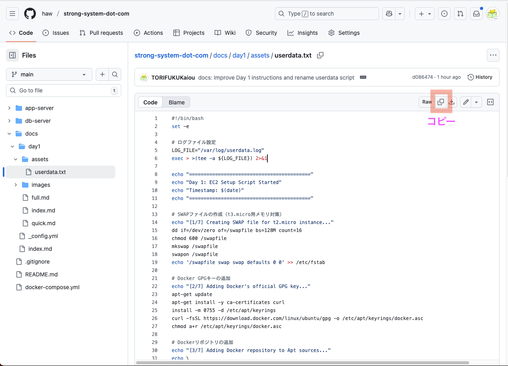

# Day 1: オンプレミス環境をクラウドへ（クイックスタート版）

## 目標

DockerコンテナをEC2で動作させ、クラウドの基本を体験する。

## 構成図


## 所要時間

約15分

---

## 事前準備済みリソース

講師が以下のリソースを作成済みです：

- **VPC**: `day1-vpc` (10.0.0.0/16)
  - パブリックサブネット × 2
  - プライベートサブネット × 2
  - インターネットゲートウェイ
  
- **セキュリティグループ**: `day1-app-sg`
  - 3000/TCP (App Server 1)
  - 3001/TCP (App Server 2)
  - 9000/TCP (MinIO API)
  - 9001/TCP (MinIO Console)
  
- **IAMロール**: `day1-ec2-role`
  - セッションマネージャー接続用

---

## 手順

### EC2インスタンス作成

1. AWSマネジメントコンソールで **EC2** サービスを開く
2. **インスタンスを起動** ボタンをクリック
    
    #### **基本設定**
    
    - **名前**: `day1-app-server-{あなたの名前}`
    - **アプリケーションおよび OS イメージ (Amazon マシンイメージ)**: 
      - **クイックスタート**: Ubuntu
      - **Amazon マシンイメージ (AMI)**: Ubuntu Server 24.04 LTS (HVM), SSD Volume Type
      - **アーキテクチャ**: 64 ビット (x86)
    
    #### **インスタンスタイプ**
    
    - **インスタンスタイプ**: t3.micro
    
    #### **キーペア**
    
    - **キーペア名**: キーペアなしで続行
    
    #### **ネットワーク設定**
    
    - **VPC**: `day1-vpc`
    - **サブネット**: パブリックサブネット (10.0.0.0/24 または 10.0.1.0/24)
    - **パブリック IP の自動割り当て**: 有効化
    - **ファイアウォール (セキュリティグループ)**: 既存のセキュリティグループを選択
      - `day1-app-sg` を選択
    
    #### **ストレージを設定**
    
    - **ルートボリューム**: 
      - **サイズ**: 12 GiB
      - **ボリュームタイプ**: gp3
    
    #### **高度な詳細**
    
    - **IAM インスタンスプロファイル**: `day1-ec2-role`
    - **ユーザーデータ**: 「<a href="https://github.com/haw/strong-system-dot-com/blob/main/docs/day1/assets/userdata.txt" target="_blank" rel="noopener noreferrer">assets/userdata.txt</a>」 の内容をコピー&ペースト
        - このユーザーデータで行っていること
            - SWAPファイルの作成
            - Dockerのインストール
            - アプリケーションリポジトリ(ソースコード)のclone
            - アプリケーションコンテナ群のビルド・起動
            - アプリケーション起動情報のログ出力
    
    

3. **インスタンスを起動** ボタンをクリック

---

## 動作確認

### 1. インスタンスの起動確認

1. EC2コンソールで **インスタンス** を選択
2. 自分のインスタンスのステータスが **実行中** になるまで待つ（約1分）
3. **ステータスチェック** が **3/3 のチェックに合格しました** になるまで待つ（約3分）

### 2. ユーザーデータ実行ログの確認

1. インスタンスを選択
2. **接続** ボタンをクリック
3. **セッションマネージャー** タブを選択
4. **接続** ボタンをクリック
5. 以下のコマンドでログを確認：

    ```bash
    sudo su - ubuntu
    sudo cat /var/log/cloud-init-output.log
    ```

6. 末尾に以下のメッセージが表示される：

    ```
    ==========================================
    Day 1: EC2 Setup Script Completed
    Timestamp: ...
    ==========================================
    
    Application URLs:
      - Employee Management System: http://xx.xx.xx.xx:3000
      - Employee Management System (Replica): http://xx.xx.xx.xx:3001
      - MinIO Console: http://xx.xx.xx.xx:9001
    ```

### 3. アプリケーションへのアクセス

1. ログに表示されたURLをブラウザで開く
2. 従業員情報管理システムが表示されることを確認

**ログイン情報:**
- ユーザー名: `admin`
- パスワード: `admin`

**従業員管理** タブ:
- 従業員情報のCRUD(Create、Read、Update、Delete)

**ファイル共有** タブ:
- 任意のファイルのアップロード
- アップロードしたファイルは右クリックで、「ダウンロード」 or 「削除」

---

## トラブルシューティング

### アプリケーションにアクセスできない

**原因1: セキュリティグループの選択ミス**
- EC2コンソールでインスタンスを選択
- **セキュリティ** タブを確認
- `day1-app-sg` が設定されているか確認

**原因2: ユーザーデータの実行失敗**
- セッションマネージャーで接続
- `sudo cat /var/log/cloud-init-output.log` でエラーを確認

**原因3: Dockerコンテナの起動失敗**
- セッションマネージャーで接続
- `cd /home/ubuntu/strong-system-dot-com`
- `docker compose ps` でコンテナの状態を確認
- `docker compose logs` でエラーログを確認

---

## クリーンアップ

研修終了後、以下の手順でインスタンスを削除してください：

1. **EC2インスタンスの削除**
   - 自分のインスタンスを選択
   - **インスタンスの状態** → **インスタンスを終了**

**注意**: VPC、セキュリティグループ、IAMロールは講師が管理しているため、削除しないでください。

---

## まとめ

- VPCでプライベートネットワークを構築
- セキュリティグループでファイアウォールルールを定義
- EC2でオンプレミス環境をクラウドに移行
- ユーザーデータで自動セットアップを実現
- セッションマネージャーで安全に接続

次回（Day 2）は、MinIOからS3への移行を行います。

---

## 参考

全手順を学びたい方は [フルスペック版](./full.md) をご覧ください。
