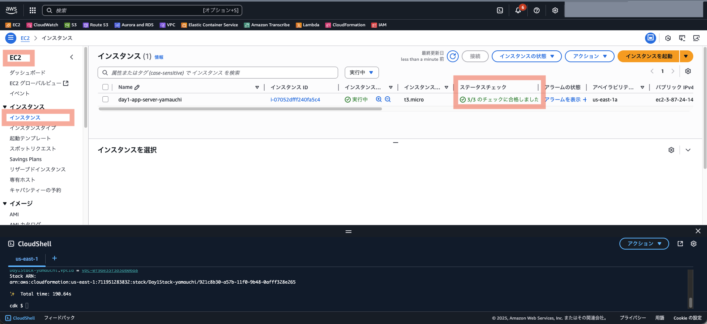

# Day 2: ストレージのクラウド化（クイックスタート版）

## 目標

- Day 1環境をCDKで自動構築（app-serverはEC2で直接実行）
- MinIOからS3への移行を体験
- IAMロールによるセキュアなS3アクセスを理解

## 所要時間

約20分

---

## 前提条件

- IAMユーザーに以下の権限が付与されていること：
  - `PowerUserAccess`
  - `IAMFullAccess`

---

## Day 2の構成


Day 2では、アプリケーションをEC2で直接実行します：

```
EC2直接実行:
└── app-server (Node.js) ← IAMロールでS3アクセス

Docker Compose:
├── db-server (MySQL)
└── ldap-server (LDAP認証)
```

**メリット**: IAMロールが自動的に使えるため、認証情報の管理が不要

> **Note**: CDKが自動的にapp-serverをEC2で直接実行するように構成します。  

---

## 手順

### 1. CloudShellを起動

> **重要**: CloudShellを起動する前に、基本的に **東京リージョン（ap-northeast-1）** を選択してください。  
> ただし、CloudShellの同時接続数が10（デフォルト）、リージョンごとのVPCの上限が5（デフォルト）の制限がありますので、同時に実施する場合はリージョンの割り振りを行います。  


1. AWSマネジメントコンソールにログイン
2. **画面右上のリージョン選択**でリージョンを選択
3. **画面左下のCloudShellアイコン**（ターミナルのようなアイコン）をクリック
4. CloudShellが起動するまで待つ（初回は1-2分）

> **なぜ東京リージョン？**: CloudShellを起動したリージョンで、CDKがインフラを作成します。東京リージョンを選択することで、日本からのアクセスが高速になります。

#### **CloudShellを以前使用したことがある方へ**

`ls`コマンドで前回のファイルが残っている場合、ディスク容量不足（1GB制限）が発生する可能性があります。その場合は、一度CloudShellを削除して立ち上げ直してください（下記図参照）。  


どうしてもCloudShellを消したくない事情がある場合は、[フルスペック版](./full.md)にて進めてください。  

---

### 2. Node.js 22のセットアップ

```bash
# nvmのインストール
curl -o- https://raw.githubusercontent.com/nvm-sh/nvm/v0.40.1/install.sh | bash
source ~/.bashrc

# Node.js 22のインストール
nvm install 22
nvm use 22
node -v  # v22.x.x と表示されることを確認
```

---

### 3. AWS CDK CLIのインストール

```bash
npm install -g aws-cdk
cdk --version  # バージョンが表示されることを確認
```

---

### 4. リポジトリのクローンとセットアップ

```bash
cd ~
git clone https://github.com/haw/strong-system-dot-com.git
cd strong-system-dot-com/docs/day2/cdk
npm install
```

---

### 5. CDK環境のBootstrap

**Bootstrapとは？**

CDKがAWS環境にデプロイするために必要なリソース（S3バケット、ECRリポジトリ、IAMロール）を事前準備するプロセスです。AWSアカウント×リージョンの組み合わせごとに1回だけ実行します。

```bash
npx cdk bootstrap -c userName={あなたの名前} --verbose
```

- `userName`の値は重複しないように指定してください。例: `npx cdk bootstrap -c userName=tanaka --verbose`  
- `userName`の値は半角英字のみを使用してください  
- **注意**: 既にbootstrap済みの場合は「bootstrapped (no changes).」と表示されますが、問題ありません。  

---

### 6. Day 2スタート環境をCDKでデプロイ

1. CDKデプロイを実行：

    ```bash
    npx cdk deploy -c userName={あなたの名前} --verbose
    ```

    例: `npx cdk deploy -c userName=tanaka` --verbose

2. デプロイ確認プロンプトで `y` を入力

3. デプロイ完了まで待つ（約5-10分）

4. デプロイ完了後、Outputsに表示される情報を確認：
    - ApplicationUrl
    - InstanceId
    - InstancePublicIp
    - S3EndpointId
    - VpcId

5. さらにEC2インスタンスのセットアップが完了するまで待つ（約3-5分）

    

---

### 7. アプリケーションの動作確認（MinIOモード）

Outputsの `ApplicationUrl` (例 http://123.123.123.123:3000) をブラウザで開く。

- ユーザー名: `admin`
- パスワード: `admin`

---

### 8. S3バケット作成

1. AWSマネジメントコンソールで **S3** サービスを開く
2. **バケットを作成** ボタンをクリック
3. 以下の設定を入力：
    - **バケット名**: `{あなたの名前}-day2-files` (例: `tanaka-day2-files`)
      - グローバルで一意である必要があります（もし、バケット名の重複エラー「同じ名前のバケットがすでに存在しています」により作成できない場合には、任意の文字列を追加してください）
      - 小文字、数字、ハイフンのみ使用可能
    - **AWS リージョン**: ap-northeast-1 (東京)
    - **パブリックアクセスをすべてブロック**: チェックを入れたまま
    - その他の設定はデフォルトのまま
4. **バケットを作成** ボタンをクリック

---

### 9. アプリケーションをS3モードに切り替え

> **注意**: MinIO使用時にアップロードしたファイルは、S3切り替え後はダウンロードできません。S3切り替え後に新規アップロードしたファイルで動作確認してください。

1. EC2コンソールで、CDKで作成されたインスタンス (`day2-app-server-{あなたの名前}`) を選択
2. **接続** → **セッションマネージャー** で接続
3. アプリケーションディレクトリに移動：

    ```bash
    sudo su - ubuntu
    cd /home/ubuntu/strong-system-dot-com/app-server
    ```

4. .envファイルを編集：

    ```bash
    nano .env
    ```

5. 以下の行を変更：

    **変更前:**
    ```
    AWS_ACCESS_KEY_ID=minioadmin
    AWS_SECRET_ACCESS_KEY=minioadmin
    AWS_REGION=ap-northeast-1
    S3_BUCKET_NAME=strongsystem-files-default
    USE_AWS_S3=false
    ```

    **編集箇所:**
    ```
    (AWS_ACCESS_KEY_IDの行を削除)
    (AWS_SECRET_ACCESS_KEYの行を削除)
    AWS_REGION=ap-northeast-1 （※ S3バケットを作成したリージョンにあわせる）
    S3_BUCKET_NAME={あなたの名前}-day2-files
    USE_AWS_S3=true
    ```

    nanoの操作：
    - Ctrl + O で保存
    - Enter でファイル名確認
    - Ctrl + X で終了

    **参考** nanoコマンドの使い方を動画でみる：
    [](https://www.youtube.com/watch?v=4eHJ1JQBuxA)

    **変更後の例(`.env`全文例):**
    ```txt:.env
    NODE_ENV=production
    PORT=3000
    DB_HOST=127.0.0.1
    DB_USER=root
    DB_PASSWORD=password
    DB_NAME=employee_db
    LDAP_SERVER=127.0.0.1
    LDAP_PORT=389
    MINIO_HOST=127.0.0.1
    MINIO_PORT=9000
    AWS_REGION=ap-northeast-1
    S3_BUCKET_NAME=tanaka-day2-files
    USE_AWS_S3=true
    ```

6. [PM2](https://github.com/Unitech/pm2)でアプリを再起動：

    ```bash
    pm2 restart app
    pm2 logs app
    ```

      
    ※ `/home/ubuntu/.pm2/logs/app-error.log` にエラーが記録されていますが、同じ内容でしたら、研修の進行に影響はありません。ログの表示は、Ctl + Cで終了できます。  

---

### 10. S3への移行確認

1. ブラウザでアプリケーション（`ApplicationUrl`）を**リロード**
2. `admin / admin`でログイン
3. 「ファイル共有」タブにて、新しいファイル（任意のファイル）をアップロード
4. S3コンソールで `{あなたの名前}-day2-files` バケットを確認
5. アップロードしたファイルがS3に保存されていることを確認
6. アプリケーションから右クリックでダウンロードが正常に動作することを確認
7. アプリケーションから右クリックで削除が正常に動作することを確認 (S3からも消えていることを確認)

---

## クリーンアップ

研修終了後、以下の順序でリソースを削除してください：

> **フルスペック版から来た方へ**: CDK実行用EC2の削除は [full.md のクリーンアップ](full.md#クリーンアップ) を参照してください。

### 1. S3バケットの削除

1. S3コンソールで自分のバケットを選択
2. **空にする** ボタンをクリック（「10. S3への移行確認」ですべてのファイルを削除している場合は、実施不要）
3. 確認後、**削除** ボタンをクリック


### 2. CDKスタックの削除

CloudShellで実行：

```bash
cd ~/strong-system-dot-com/docs/day2/cdk
npx cdk destroy -c userName={あなたの名前} --verbose
```

削除確認があるので、`y` + Enter でスタックの削除が開始される。  

---

## まとめ

- CloudShellでCDK実行環境を即座に構築
- CDKでインフラ自動構築
- app-serverをEC2で直接実行（IAMロールでS3アクセス）
- MinIO → S3 移行完了

次回（Day 3）は、データベースをRDSに移行します。

---

## 参考

全手順を学びたい方は [フルスペック版](./full.md) をご覧ください。
