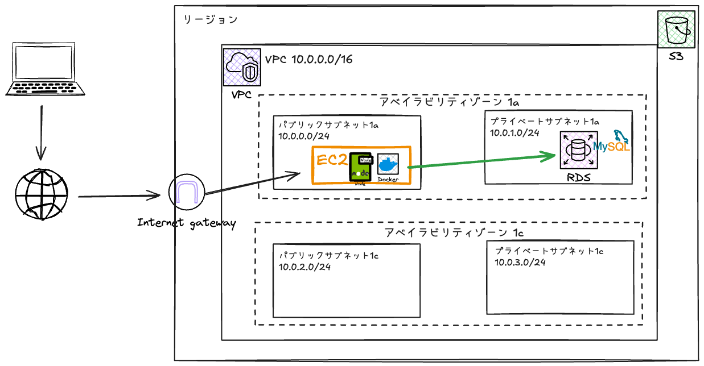
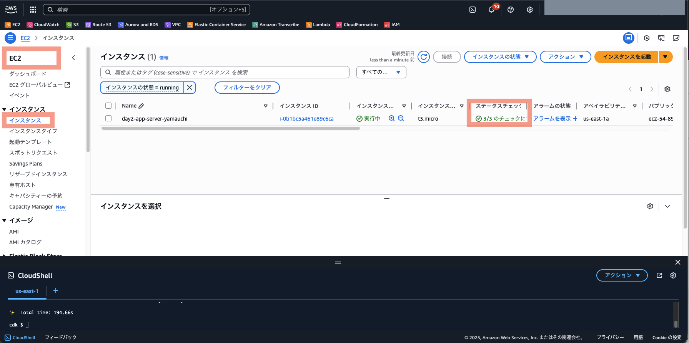
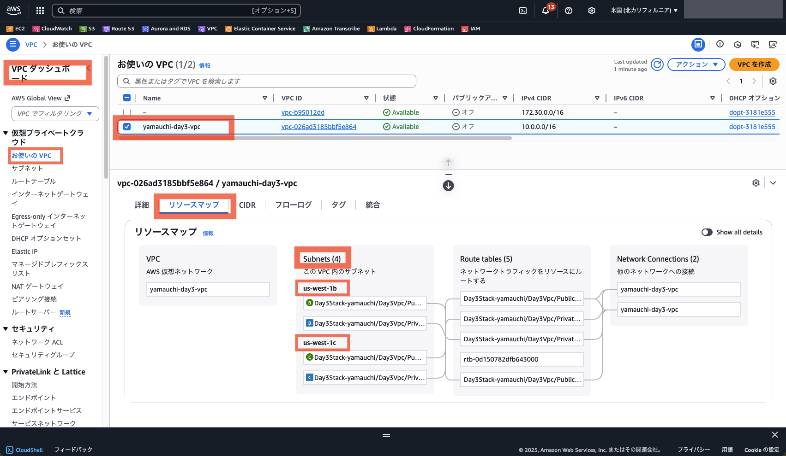
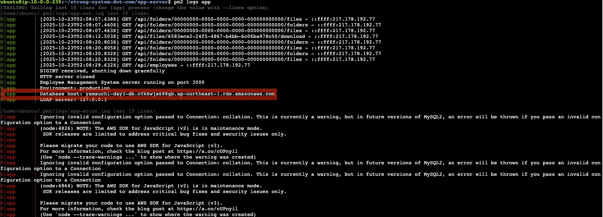

# Day 3: データベースのクラウド化（クイックスタート版）

## 目標

- Day 2完了環境（S3移行済み）をCDKで自動構築
- MySQLコンテナからRDSへの移行を体験
- RDSのマネージドサービスのメリットを理解

## 所要時間

約30分

---

## 前提条件

- IAMユーザーに以下の権限が付与されていること：
  - `PowerUserAccess`
  - `IAMFullAccess`

---

## Day 3の構成



Day 3では、データベースをRDSに移行します：

**スタート時点（Day 2完了状態）:**
```
EC2直接実行:
└── app-server (Node.js) ← S3アクセス

Docker Compose:
├── db-server (MySQL) ← これをRDSに移行
└── ldap-server (LDAP認証)
```

**ゴール（Day 3完了状態）:**
```
EC2直接実行:
└── app-server (Node.js) ← RDS + S3アクセス

Docker Compose:
└── ldap-server (LDAP認証)

AWS RDS:
└── MySQL ← マネージドデータベース
```

---

## 手順

### 1. CloudShellを起動

> **重要**: CloudShellを起動する前に、基本的に **東京リージョン（ap-northeast-1）** を選択してください。  
> ただし、CloudShellの同時接続数が10（デフォルト）、リージョンごとのVPCの上限が5（デフォルト）の制限がありますので、同時に実施する場合はリージョンの割り振りを行います。  

1. AWSマネジメントコンソールにログイン
2. **画面右上のリージョン選択**でリージョンを選択
3. **画面左下のCloudShellアイコン**（ターミナルのようなアイコン）をクリック
4. CloudShellが起動するまで待つ（初回は1-2分）

もし、`ls`をして前回の`strong-system-dot-com`ディレクトリが残っているようであれば、一度CloudShellを消して、立ち上げ直してください（下記図参照）。(ディスク容量不足が発生する場合があるため)  


---

### 2. Node.js 22のセットアップ

```bash
# nvmのインストール
curl -o- https://raw.githubusercontent.com/nvm-sh/nvm/v0.40.1/install.sh | bash
source ~/.bashrc

# Node.js 22のインストール
nvm install 22
nvm use 22
node -v  # v22.x.x と表示されることを確認
```

---

### 3. AWS CDK CLIのインストール

```bash
npm install -g aws-cdk
cdk --version  # バージョンが表示されることを確認
```

---

### 4. リポジトリのクローンとセットアップ

```bash
cd ~
git clone https://github.com/haw/strong-system-dot-com.git
cd strong-system-dot-com/docs/day3/cdk
npm install
```

---

### 5. CDK環境のBootstrap（Day 2で実施済みの場合はスキップ可）

```bash
npx cdk bootstrap -c userName={あなたの名前} --verbose
```

- Day 2で既にbootstrap済みのため「bootstrapped (no changes).」と表示されます

---

### 6. Day 2完了環境をCDKでデプロイ

1. CDKデプロイを実行：

    ```bash
    npx cdk deploy -c userName={あなたの名前} --verbose
    ```

    例: `npx cdk deploy -c userName=tanaka --verbose`

2. デプロイ確認プロンプトで `y` を入力

3. デプロイ完了まで待つ（約5-10分）

4. デプロイ完了後、Outputsに表示される情報を確認：
    - ApplicationUrl
    - InstanceId
    - S3BucketName
    - VpcId

5. EC2インスタンスのセットアップが完了するまで待つ（約3-5分）

    - EC2インスタンスの一覧で「ステータスチェック」が完了するのを待つ
    - 時間が経てば完了するはずなので、待っている間に以降の手順8, 9, 10を進めてよい
    

---

### 7. Day 2完了状態の動作確認

Outputsの `ApplicationUrl` をブラウザで開く。

- ユーザー名: `admin`
- パスワード: `admin`

ファイルアップロード・ダウンロードが正常に動作することを確認（S3使用）。

---

### 8. RDS用サブネットグループの作成

1. AWSマネジメントコンソールで **Aurora and RDS** サービスを開く
2. 左メニューから **サブネットグループ** を選択
3. **DBサブネットグループを作成** ボタンをクリック
4. 以下の設定を入力：
    - **名前**: `{あなたの名前}-day3-db-subnet-group` (例: `tanaka-day3-db-subnet-group`)
    - **説明**: `Day 3 RDS subnet group`
    - **VPC**: CDKで作成されたVPC（`{あなたの名前}-day3-vpc`）を選択
    - **アベイラビリティーゾーン**: 
      - `ap-northeast-1a` を選択 (※ VPCサブネットが構築されたアベイラビリティゾーンで読み替え)
      - `ap-northeast-1c` を選択 (※ VPCサブネットが構築されたアベイラビリティゾーンで読み替え)
    - **サブネット**: 
      - Private サブネット（10.0.2.0/24）を選択
      - Private サブネット（10.0.3.0/24）を選択
5. **作成** ボタンをクリック

> **Note** VPCサブネットが構築されたアベイラビリティゾーンの確認方法



---

### 9. RDS用セキュリティグループの作成

1. AWSマネジメントコンソールで **VPC** サービスを開く
2. 左メニューから **セキュリティグループ** を選択
3. **セキュリティグループを作成** ボタンをクリック
4. 以下の設定を入力：
    - **セキュリティグループ名**: `{あなたの名前}-day3-rds-sg` (例: `tanaka-day3-rds-sg`)
    - **説明**: `Security group for Day 3 RDS`
    - **VPC**: CDKで作成されたVPC（`{あなたの名前}-day3-vpc`）を選択
5. **インバウンドルール** セクションで **ルールを追加** をクリック：
    - **タイプ**: MySQL/Aurora (3306)
    - **ソース**: カスタム
    - **ソースの選択**: EC2のセキュリティグループ（`day3-app-sg-{あなたの名前}`）を選択（🔍️ にセキュリティグループ名を入力すると候補がでる）
    - **説明**: `Allow MySQL from EC2`
6. **セキュリティグループを作成** ボタンをクリック

---

### 10. RDSインスタンスの作成

1. RDSコンソールで **データベース** を選択
2. **データベースの作成** ボタンをクリック
3. 以下の設定を入力：

    **データベース作成方法を選択:**
    - **標準作成**

    **エンジンのオプション:**
    - **エンジンのタイプ**: MySQL
    - **エンジンのバージョン**: MySQL 8.4.5

    **テンプレート:**
    - **無料利用枠** を選択

    **可用性と耐久性**
    - **シングル AZ DB インスタンスデプロイ (1 インスタンス)**

    **設定:**
    - **DBインスタンス識別子**: `{あなたの名前}-day3-db` (例: `tanaka-day3-db`)
    - **マスターユーザー名**: `admin`
    - **認証情報管理**: `セルフマネージド`
    - **マスターパスワード**: `password123`（研修用、本番では強力なパスワードを使用）
    - **マスターパスワードを確認**: `password123`

    **インスタンスの設定:**
    - **DBインスタンスクラス**: db.t3.micro

    **ストレージ:**
    - **ストレージタイプ**: 汎用SSD (gp3)
    - **割り当てられたストレージ**: 20 GiB
    - **追加のストレージ設定 > ストレージの自動スケーリングを有効にする**: チェックを外す

    **接続:**
    - **コンピューティングリソース**: EC2コンピューティングリソースに接続しない
    - **ネットワークタイプ**: IPv4
    - **VPC**: CDKで作成されたVPC（`{あなたの名前}-day3-vpc`）を選択
    - **DBサブネットグループ**: 作成したサブネットグループを選択
    - **パブリックアクセス**: なし
    - **VPCセキュリティグループ**: 既存の選択
      - `default` セキュリティグループを削除
      - 作成したRDS用セキュリティグループ（`{あなたの名前}-day3-rds-sg`）を選択
    - **アベイラビリティーゾーン**: 指定なし（DBサブネットグループから自動的に選択されます）

    **データベース認証:**
    - **パスワード認証** を選択

    **モニタリング**
    - デフォルトのまま

    **追加設定:**
    - **最初のデータベース名**: `employee_db`
    - **DBパラメータグループ**: デフォルトのまま
    - **オプショングループ**: デフォルトのまま
    - **バックアップ**: 
      - **自動バックアップを有効にする**: チェックを外す（研修用）
    - **暗号化**: 
      - **暗号化を有効にする**: チェックを入れたまま（推奨）
      - セキュリティベストプラクティスとして暗号化を有効化
    - **マイナーバージョン自動アップグレードの有効化**: デフォルトのまま
    - **メンテナンスウィンドウ**: デフォルトのまま
    - **削除保護の有効化**: チェックを外す

4. **データベースの作成** ボタンをクリック

5. RDSインスタンスが **利用可能** になるまで待つ（約5-10分）
    - 待っている間に、次の手順「11. MySQLコンテナからデータをダンプ」へ進んでもよい

6. RDSインスタンスの **エンドポイント** をメモする
   - 例: `tanaka-day3-db.xxxxxxxxxx.ap-northeast-1.rds.amazonaws.com`

---

### 11. MySQLコンテナからデータをダンプ

1. EC2コンソールで、CDKで作成されたインスタンス (`day3-app-server-{あなたの名前}`) を選択
2. **接続** → **セッションマネージャー** で接続
3. ubuntuユーザーに切り替え：

    ```bash
    sudo su - ubuntu
    cd ~
    ```

4. MySQLコンテナからデータをダンプ：

    ```bash
    cd /home/ubuntu/strong-system-dot-com

    docker compose exec db-server mysqldump -uroot -ppassword employee_db > employee_db_dump.sql
    ```

5. ダンプファイルが作成されたことを確認：

    ```bash
    ls -lh employee_db_dump.sql
    ```

---

### 12. RDSへデータをインポート

1. MySQL Clientをインストール：

    ```bash
    sudo apt-get update
    sudo apt-get install -y mysql-client
    ```

2. RDSに接続してデータをインポート：

    ```bash
    mysql -h {RDSエンドポイント} -u admin -ppassword123 employee_db < employee_db_dump.sql
    ```

    例:
    ```bash
    mysql -h tanaka-day3-db.xxxxxxxxxx.ap-northeast-1.rds.amazonaws.com -u admin -ppassword123 employee_db < employee_db_dump.sql
    ```

3. インポートが成功したことを確認：

    ```bash
    mysql -h {RDSエンドポイント} -u admin -ppassword123 employee_db -e "SHOW TABLES;"
    ```

    `employees` テーブルが表示されることを確認。

---

### 13. アプリケーションの接続先をRDSに変更

1. アプリケーションディレクトリに移動：

    ```bash
    cd /home/ubuntu/strong-system-dot-com/app-server
    ```

2. .envファイルを編集：

    ```bash
    nano .env
    ```

3. データベース接続設定を変更：

    **変更前:**
    ```
    DB_HOST=127.0.0.1
    DB_USER=root
    DB_PASSWORD=password
    DB_NAME=employee_db
    ```

    **変更箇所:**
    ```
    DB_HOST={RDSエンドポイント}
    DB_USER=admin
    DB_PASSWORD=password123
    ```

    nanoの操作：
    - Ctrl + O で保存
    - Enter でファイル名確認
    - Ctrl + X で終了

    **参考** nanoコマンドの使い方を動画でみる：
    [](https://www.youtube.com/watch?v=4eHJ1JQBuxA)

    **変更後の例(`.env`全文例):**
    ```txt:.env
    NODE_ENV=production
    PORT=3000
    DB_HOST=tanaka-day3-db.c0k6wja688gb.ap-northeast-1.rds.amazonaws.com
    DB_USER=admin
    DB_PASSWORD=password123
    DB_NAME=employee_db
    LDAP_SERVER=127.0.0.1
    LDAP_PORT=389
    AWS_REGION=ap-northeast-1
    S3_BUCKET_NAME=day3stack-tanaka-filesbucket16450113-wvdrili2hpzp
    USE_AWS_S3=true
    ```

4. [PM2](https://github.com/Unitech/pm2)でアプリを再起動：

    ```bash
    pm2 restart app
    pm2 logs app
    ```

5. ログに `Database host: {RDSエンドポイント}` が表示されることを確認

    例:  
    ```
    Database host: tanaka-day3-db.xxxxxxxxxx.ap-northeast-1.rds.amazonaws.com
    ```

    「Ctl + C」でログ表示を終了

      
    ※ `/home/ubuntu/.pm2/logs/app-error.log` にエラーが記録されていますが、同じ内容でしたら、研修の進行に影響はありません。ログの表示は、Ctl + Cで終了できます。  

---

### 14. RDS移行の動作確認

1. ブラウザでアプリケーション（`ApplicationUrl`）を**リロード**
2. `admin / admin`でログイン
3. 既存の従業員データが表示されることを確認（RDSから取得）
4. 新しい従業員を追加して、RDSに保存されることを確認
5. ファイルアップロード・ダウンロードも正常に動作することを確認（S3使用）

---

### 15. MySQLコンテナの停止（オプション）

RDS移行が完了したので、MySQLコンテナは不要になりました：

```bash
cd /home/ubuntu/strong-system-dot-com
docker compose stop db-server
```

---

## クリーンアップ

研修終了後、以下の順序でリソースを削除してください：

### 1. RDSインスタンスの削除

1. RDSコンソールで自分のRDSインスタンスを選択
2. **アクション** → **削除** をクリック
3. 確認画面で：
   - **最終スナップショットを作成**: チェックを外す
   - **私は、インスタンスの削除後、システムスナップショットとポイントインタイムの復元を含む自動バックアップが利用不可となることを了承します。**: チェック
   - 確認テキストを入力
4. **削除** ボタンをクリック

※ 削除に5分ほどかかるので次の手順へ進んでよい。  

### 2. RDS用セキュリティグループの削除

1. VPCコンソールで自分のRDS用セキュリティグループ（例： `tanaka-day3-rds-sg`）を選択
2. **アクション** → **セキュリティグループの削除** をクリック

※ RDS インスタンスのネットワークインターフェースと関連付いていて削除できない場合がありますが、少し間をあけると消せるようになります。

### 3. RDS用サブネットグループの削除

1. RDSコンソールで **サブネットグループ** を選択
2. 自分のサブネットグループ（例: `tanaka-day3-db-subnet-group`）を選択
3. **削除** ボタンをクリック

※ RDS インスタンスが消えるまで、消せないですし、料金が発生するものでもないので、エラーが出た場合は次の手順へ進んでください。  

### 4. CDKスタックの削除

CloudShellで実行：

```bash
cd ~/strong-system-dot-com/docs/day3/cdk
npx cdk destroy -c userName={あなたの名前} --verbose
```

> **Note**: S3バケットは `cdk destroy` で自動的に削除されます（`autoDeleteObjects: true` 設定により、バケット内のオブジェクトも自動削除）。手動削除は不要です。

---

## まとめ

- Day 2完了環境（S3移行済み）をCDKで自動構築
- RDS用のサブネットグループとセキュリティグループを作成
- RDSインスタンスを作成（シングルAZ、db.t3.micro）
- MySQLコンテナからRDSへデータ移行
- アプリケーションの接続先をRDSに変更
- マネージドデータベースのメリットを体験

次回（Day 4）は、サーバーレスアーキテクチャに移行します。

---

## RDSのメリット

- **自動バックアップ**: 指定した期間のバックアップを自動取得
- **自動パッチ適用**: セキュリティパッチやマイナーバージョンアップを自動適用
- **Multi-AZ構成**: 高可用性を実現（本番環境推奨）
- **リードレプリカ**: 読み取り負荷の分散
- **モニタリング**: CloudWatchとの統合
- **スケーリング**: ストレージやインスタンスタイプの変更が容易
