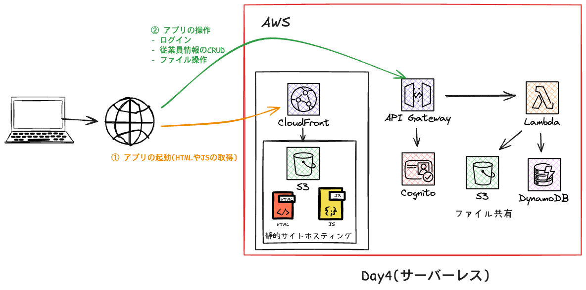
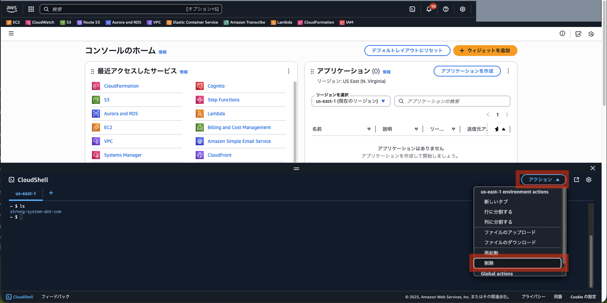
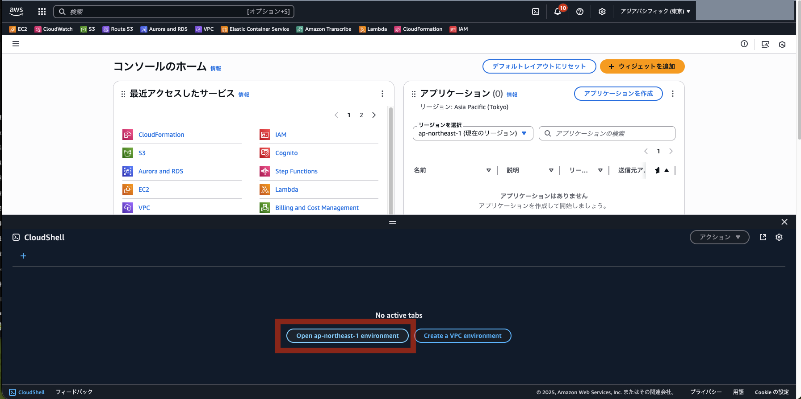

# Day 4: サーバーレスアーキテクチャへの移行

## 目標

- 従来型3層アーキテクチャからサーバーレスへの完全移行を体験
- CloudFront + S3 + API Gateway + Lambda + DynamoDB + Cognitoの構成を理解
- マネージドサービスによる運用コスト削減と可用性向上を実感

## 所要時間

約30分

---

## 前提条件

- IAMユーザーに以下の権限が付与されていること：
  - `PowerUserAccess`
  - `IAMFullAccess`

---

## Day 4の構成



Day 4では、完全サーバーレスアーキテクチャに移行します：

```
フロントエンド:
└── CloudFront + S3 (静的サイトホスティング)

バックエンド:
├── API Gateway (REST API)
├── Lambda (Node.js 22) ← AWS SDK v3
├── DynamoDB (On-Demand) ← 50%値下げ！
├── Cognito User Pools (認証)
└── S3 (ファイルストレージ)
```

**Day 1-3との違い**:
- ✅ サーバー管理不要（EC2なし）
- ✅ 自動スケーリング
- ✅ 従量課金（使った分だけ）
- ✅ 高可用性（マルチAZ自動）

---

## 手順

### 1. CloudShellを起動

> **重要**: CloudShellを起動する前に、基本的に **東京リージョン（ap-northeast-1）** を選択してください。  
> ただし、CloudShellの同時接続数が10（デフォルト）、リージョンごとのVPCの上限が5（デフォルト）などの制限がありますので、同時に実施する場合はリージョンの割り振りを行います。  

1. AWSマネジメントコンソールにログイン
2. **画面右上のリージョン選択**で「**アジアパシフィック（東京）ap-northeast-1**」を選択（※ **割り振られたリージョンを選択**）
3. **画面左下のCloudShellアイコン**（ターミナルのようなアイコン）をクリック
4. CloudShellが起動するまで待つ（初回は1-2分）

もし、`ls`をして前回の`strong-system-dot-com`ディレクトリが残っているようであれば、一度CloudShellを消して、立ち上げ直してください（下記図参照）。(ディスク容量不足が発生する場合があるため)  






---

### 2. Node.js 22のセットアップ

```bash
# nvmのインストール
curl -o- https://raw.githubusercontent.com/nvm-sh/nvm/v0.40.1/install.sh | bash
source ~/.bashrc

# Node.js 22のインストール
nvm install 22
nvm use 22
node -v  # v22.x.x と表示されることを確認
```

---

### 3. リポジトリのクローン

```bash
git clone https://github.com/haw/strong-system-dot-com.git
cd strong-system-dot-com/docs/day4/cdk
```

---

### 4. 依存関係のインストール

```bash
# CDKプロジェクトの依存関係のみインストール
npm install
```

> **Note**: Lambda関数（`lambda/api`、`lambda/seed`）での`npm install`は不要です。Node.js 22 Runtimeに必要なAWS SDK v3がすべて含まれています。

---

### 5. CDKのブートストラップ（初回のみ）

> **Note**: 同じAWSアカウント・リージョンで初めてCDKを使う場合のみ実行してください。

```bash
# あなたの名前を指定してブートストラップ（例: yamada）
npx cdk bootstrap -c userName=yamada --verbose
```

> **重要**: `userName`は**半角英字のみ**で指定してください。日本語や記号は使用できません。

---

### 6. デプロイ

```bash
# あなたの名前を指定してデプロイ（例: yamada）
npx cdk deploy -c userName=yamada --verbose
```

> **重要**: `userName`は**半角英字のみ**で指定してください。日本語や記号は使用できません。

デプロイには約7-15分かかります。以下のリソースが作成されます：

- Cognito User Pool（認証）
- DynamoDB Tables（従業員・ファイルメタデータ）
- S3 Buckets（静的サイト・ファイルストレージ）
- Lambda Functions（API・Seed）
- API Gateway（REST API）
- CloudFront Distribution（CDN）

---

### 8. デプロイ完了後の確認

デプロイが完了すると、以下の情報が表示されます：

#### Outputs例

```
Outputs:
Day4Stack-yamauchi.ApiEndpoint4F160690 = https://1d5gubtnja.execute-api.us-east-1.amazonaws.com/prod/
Day4Stack-yamauchi.ApiUrl = https://1d5gubtnja.execute-api.us-east-1.amazonaws.com/prod/
Day4Stack-yamauchi.CloudFrontUrl = https://dxybt5mgl9ojb.cloudfront.net
Day4Stack-yamauchi.EmployeeTableName = day4-employees-yamauchi
Day4Stack-yamauchi.FilesBucketName = day4stack-yamauchi-filesbucket16450113-pauamfwpa82t
Day4Stack-yamauchi.FilesTableName = day4-files-yamauchi
Day4Stack-yamauchi.UserPoolClientId = 7n27c44fm25e2u76bb85o79n0q
Day4Stack-yamauchi.UserPoolId = us-east-1_ZUuUZjFQf
Stack ARN:
arn:aws:cloudformation:us-east-1:711951283832:stack/Day4Stack-yamauchi/d4491ea0-a658-11f0-a289-0affcf84f6bb
```

**CloudFrontUrl**をブラウザで開いてください。

---

## アプリケーションの使い方

### 1. 新規登録

1. **CloudFrontUrl**をブラウザで開く
2. 「新規登録」をクリック
3. 以下を入力：
   - **名前**: 山田 太郎
   - **ユーザー名**: yamada（半角英数字）
   - **パスワード**: Test1234（8文字以上、大文字・小文字・数字を含む）
4. 「登録」をクリック
5. 登録成功メッセージが表示されます

### 2. ユーザー承認（システム運用体験）

サインアップ後、ユーザーは「未確認」状態です。以下の手順で自分自身を承認してください：

1. **Cognito User Pools コンソール**を開く
    ```
    https://console.aws.amazon.com/cognito/v2/idp/user-pools?region=ap-northeast-1
    ```
    > **Note**: リージョンはリソースを作成したリージョンに合わせてください（例: `us-east-1`, `ap-northeast-1`）

2. `day4-user-pool-{あなたの名前}` を選択
3. **ユーザー（Users）** をクリック (左方メニュー)
4. 自分のユーザー名（例: yamada）をクリック
5. **アクション（Actions）** → **アカウントの確認（Confirm account）** をクリック
6. 確認ステータスが「確認済（Confirmed）」になったことを確認

    > **Note**: 管理者が承認を体験します。

### 3. ログイン

1. アプリケーション画面に戻る
2. 登録したユーザー名とパスワードでログイン
3. 従業員管理画面が表示されます

### 4. 従業員管理

初期データとして10名の従業員が登録されています：

- **追加**: 「➕ 従業員を追加」ボタン
- **編集**: 各行の「編集」ボタン
- **削除**: 各行の「削除」ボタン

### 5. ファイル共有

1. 「📁 ファイル共有」タブをクリック
2. 「📤 ファイルを選択」でファイルを選択
3. 「⬆️ アップロード」をクリック
4. アップロードしたファイルは：
   - **ダウンロード**: 「ダウンロード」ボタン
   - **削除**: 「削除」ボタン

---

## Day 1-3との比較

| 項目 | Day 1-3（従来型） | Day 4（サーバーレス） |
|------|------------------|---------------------|
| サーバー管理 | EC2の管理が必要 | 不要（フルマネージド） |
| スケーリング | 手動 | 自動 |
| 可用性 | 単一AZ | マルチAZ自動 |
| 料金 | 常時稼働 | 従量課金 |
| 運用コスト | 高い | 低い |

---

## トラブルシューティング

### デプロイエラー

**エラー**: `User: arn:aws:iam::xxx:user/xxx is not authorized to perform: iam:CreateRole`

**解決策**: IAMユーザーに`IAMFullAccess`権限を付与してください。

---

### CloudFrontにアクセスできない

**原因**: CloudFrontの配信には5-10分かかります。

**解決策**: 少し待ってから再度アクセスしてください。

---

### ログインできない

**原因**: パスワードポリシーを満たしていない可能性があります。

**解決策**: 以下の条件を満たすパスワードを設定してください：
- 8文字以上
- 大文字を含む
- 小文字を含む
- 数字を含む

---

## リソースの削除

研修終了後、以下のコマンドでリソースを削除してください：

```bash
cd strong-system-dot-com/docs/day4/cdk
npx cdk destroy -c userName=yamada --verbose
```

削除確認があるので、 **`y` + Enter でスタックの削除** が開始される。  

> **Note**: CloudFrontの削除には15-20分かかります。

---

## 技術詳細

### アーキテクチャのポイント

1. **Presigned URL方式**: ファイルアップロード/ダウンロードは、Lambda経由ではなくS3への直接アクセス（セキュア）
2. **Cognito認証**: JWT tokenによるステートレス認証
3. **DynamoDB On-Demand**: 2024年11月に50%値下げ、プロビジョニング不要
4. **Lambda Node.js 22**: 2025年最新ランタイム、AWS SDK v3バンドル
5. **Custom Resource**: デプロイ時に初期データ自動投入

### コスト試算（月間）

**想定条件:**
- 受講生: 35名
- 利用時間: 1日1時間×30日
- 操作: ログイン、従業員CRUD、ファイル操作

#### 新規アカウント（12ヶ月無料枠あり）

| サービス | 無料枠 | 使用量（35名） | 月額コスト |
|---------|--------|--------------|----------|
| Lambda | 100万リクエスト/月（永久） | ~48,300リクエスト | **$0** |
| DynamoDB | ストレージ25GB（永久）<br>※RCU/WCUは課金 | ~14,490 WRU<br>~33,810 RRU | **$0.031** |
| S3 | 5GB/20,000 GET（12ヶ月） | 175MB/5,250 GET | **$0** |
| CloudFront | 1TB/1,000万リクエスト（12ヶ月） | 2.1GB/48,300リクエスト | **$0** |
| API Gateway | 100万コール（12ヶ月） | 48,300コール | **$0** |
| Cognito | 10,000 MAU（永久） | 35 MAU | **$0** |

**合計: 約$0.031/月（約4.7円）**

#### 12ヶ月経過後

| サービス | 永久無料枠 | 使用量（35名） | 月額コスト |
|---------|-----------|--------------|----------|
| Lambda | 100万リクエスト/月 | ~48,300リクエスト | **$0** |
| DynamoDB | ストレージ25GBのみ | ~14,490 WRU<br>~33,810 RRU | **$0.031** |
| S3 | なし | 175MB/5,250 GET | **$0.031** |
| CloudFront | なし | 2.1GB/48,300リクエスト | **$0.30** |
| API Gateway | なし | 48,300コール | **$0.21** |
| Cognito | 10,000 MAU | 35 MAU | **$0** |

**合計: 約$0.57/月（約86円）**

> **Note**: 受講生35名でも月額100円未満です。Lambda・Cognitoは永久無料枠で利用可能です。

---

## 参考資料

- [AWS Lambda Node.js 22](https://aws.amazon.com/blogs/compute/node-js-22-runtime-now-available-in-aws-lambda/)
- [DynamoDB 50% Price Reduction](https://aws.amazon.com/about-aws/whats-new/2024/11/amazon-dynamo-db-reduces-prices-on-demand-throughput-global-tables/)
- [CloudFront 2025 Features](https://docs.aws.amazon.com/AmazonCloudFront/latest/DeveloperGuide/Introduction.html)
