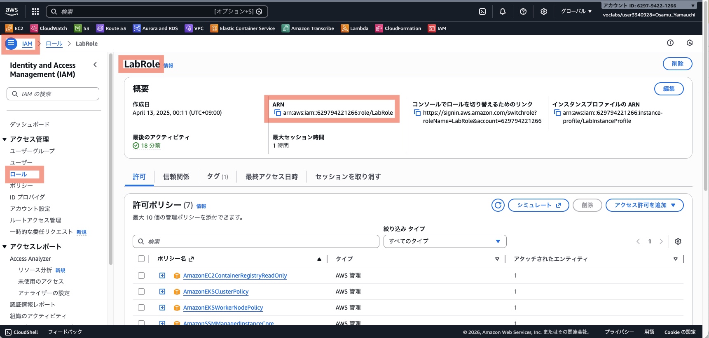
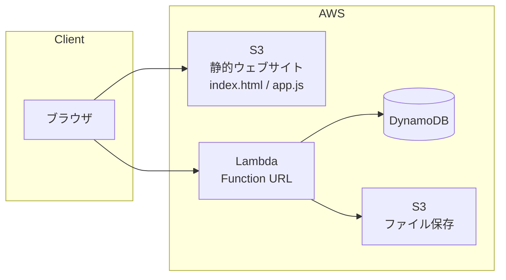
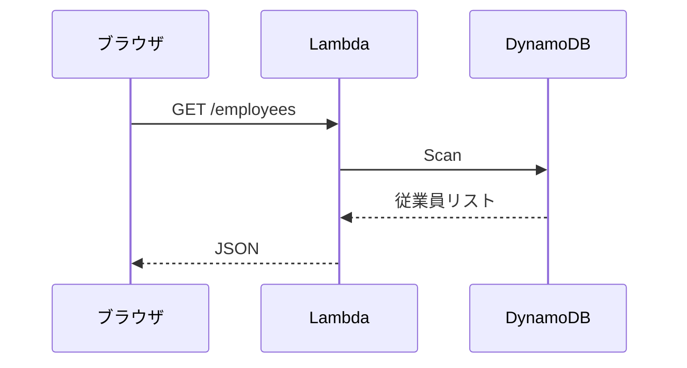
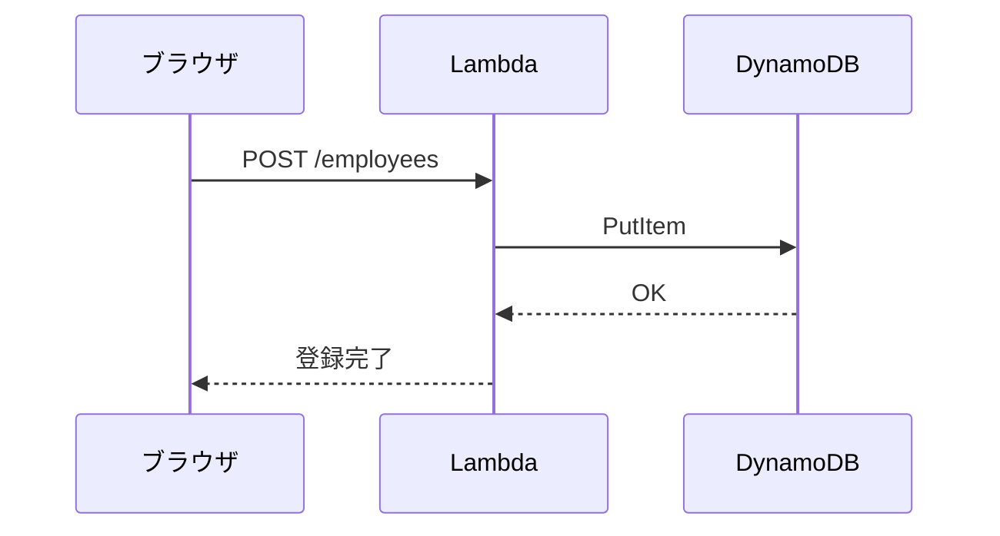
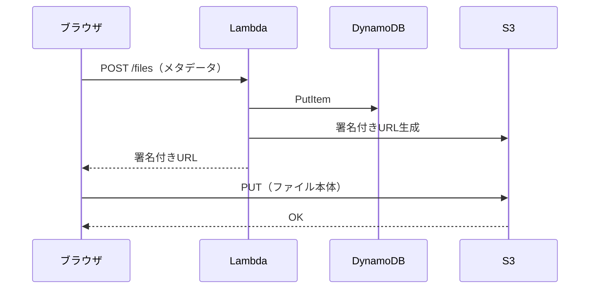

# Day4 CloudFormation ハンズオン（AWS Academy版）

## 概要

サーバーレスアーキテクチャ（Lambda Function URL + DynamoDB + S3）をCloudFormationでデプロイします。

## 使用するAWSサービス

### AWS Lambda
- サーバーレスの中核サービス
- サーバー管理不要、コードをアップロードするだけ
- 標準ランタイム: Node.js, Python, Java, Go, .NET など
- 実行した分だけ課金（リクエスト数 + 実行時間）
- 今回は Function URL でHTTPエンドポイントを公開

### Amazon DynamoDB
- フルマネージドNoSQLデータベース
- Key-Valueストア + ドキュメントDB
- 水平方向にスケール（データ量・リクエスト数に応じて自動拡張）
- ミリ秒単位のレイテンシ
- **プライマリキー**:
  - **パーティションキー（必須）**: データの分散先を決めるキー。同じ値は同じパーティションに格納
  - **ソートキー（オプション）**: パーティション内での並び順を決めるキー
- 今回は `id`（UUID）をパーティションキーとして使用（ソートキーなし）

### Amazon S3
- オブジェクトストレージ
- 99.999999999%（イレブンナイン）の耐久性
- 通常はプライベート（公開しない）
- 今回の用途:
  - **FilesBucket**: アップロードファイル保存（非公開、署名付きURLでアクセス）
  - **WebsiteBucket**: 静的ウェブサイトホスティング（フロントエンド公開用）

## 事前準備

1. AWS Academy Learner Labを起動
2. リージョンが **us-east-1（バージニア北部）** であることを確認
3. LabRoleのARNを確認: IAMコンソール → ロール → `LabRole` → ARNをコピー
   - 形式: `arn:aws:iam::XXXXXXXXXXXX:role/LabRole`



## 構成図



## シーケンス図

### 従業員一覧取得（GET /employees）



### 従業員登録（POST /employees）



### ファイルアップロード



## 手順

### Step 1: S3バケット作成（Lambda用）

1. S3コンソールを開く
2. 「バケットを作成」をクリック
3. バケット名: `day4-lambda-YYYYMMDD-yourname`（例: `day4-lambda-20260109-taro`）
4. リージョン: us-east-1
5. 他はデフォルトのまま「バケットを作成」

### Step 2: [api.zip](https://github.com/haw/strong-system-dot-com/blob/main/docs/day4/cf/academy/api.zip)をアップロード

1. 作成したバケットを開く
2. 「アップロード」をクリック
3. [api.zip](https://github.com/haw/strong-system-dot-com/blob/main/docs/day4/cf/academy/api.zip) をアップロード

### Step 3: CloudFormationスタック作成

1. CloudFormationコンソールを開く
2. 「スタックの作成」→「新しいリソースを使用（標準）」
3. 「テンプレートファイルのアップロード」を選択
4. [template.yaml](https://github.com/haw/strong-system-dot-com/blob/main/docs/day4/cf/academy/template.yaml) をアップロード
5. 「次へ」

### Step 4: パラメータ入力

- スタック名: `day4-stack`
- LabRoleArn: 事前準備でコピーしたLabRoleのARN
- LambdaCodeBucket: Step 1で作成したバケット名
- 「次へ」→「次へ」→「送信」

### Step 5: デプロイ完了を待つ

- ステータスが `CREATE_COMPLETE` になるまで待機（5〜10分）
- 「出力」タブで以下を確認:
  - **FunctionUrl**: API エンドポイント
  - **CloudFrontUrl**: フロントエンドURL
  - **WebsiteBucketName**: フロントエンドアップロード先

## 動作確認（API）

CloudShellで以下を実行（URLは「出力」タブの FunctionUrl に置き換え）:

```bash
# 従業員一覧取得
curl https://xxxxxx.lambda-url.us-east-1.on.aws/employees

# 従業員登録
curl -X POST https://xxxxxx.lambda-url.us-east-1.on.aws/employees \
  -H "Content-Type: application/json" \
  -d '{"name": "山田太郎", "email": "yamada@example.com", "department": "開発部", "position": "エンジニア"}'

# 従業員一覧取得（登録確認）
curl https://xxxxxx.lambda-url.us-east-1.on.aws/employees
```

## フロントエンドのデプロイ

### Step 1: app.jsのAPI URL設定

[frontend/app.js](https://github.com/haw/strong-system-dot-com/blob/main/docs/day4/cf/academy/frontend/app.js) の4行目を編集:

```javascript
// 変更前
const API_URL = 'FUNCTION_URL_PLACEHOLDER';

// 変更後（出力タブのFunctionUrlに置き換え、末尾のスラッシュは削除）
const API_URL = 'https://xxxxxx.lambda-url.us-east-1.on.aws';
```

### Step 2: フロントエンドをS3にアップロード

1. S3コンソールで **WebsiteBucketName** のバケットを開く
2. 「アップロード」をクリック
3. 以下をアップロード:
   - [index.html](https://github.com/haw/strong-system-dot-com/blob/main/docs/day4/cf/academy/frontend/index.html)
   - `app.js`（Step 1で編集したもの）

### Step 3: フロントエンド動作確認

1. 「出力」タブの **CloudFrontUrl** にアクセス
2. 従業員の追加・編集・削除ができることを確認
3. ファイルのアップロード・ダウンロード・削除ができることを確認

## クリーンアップ

1. CloudFormationコンソールでスタックを削除
2. S3バケット（Lambda用）を空にして削除

## トラブルシューティング

### CREATE_FAILED になった場合

1. 「イベント」タブでエラー内容を確認
2. よくある原因:
   - LabRoleArnが間違っている
   - S3バケット名が間違っている
   - api.zipがアップロードされていない
   - リージョンがus-east-1以外

### CORSエラーが出る場合

- app.jsのAPI_URLが正しいか確認
- 末尾にスラッシュがないか確認（`https://xxx.on.aws` が正しい、`https://xxx.on.aws/` は間違い）
