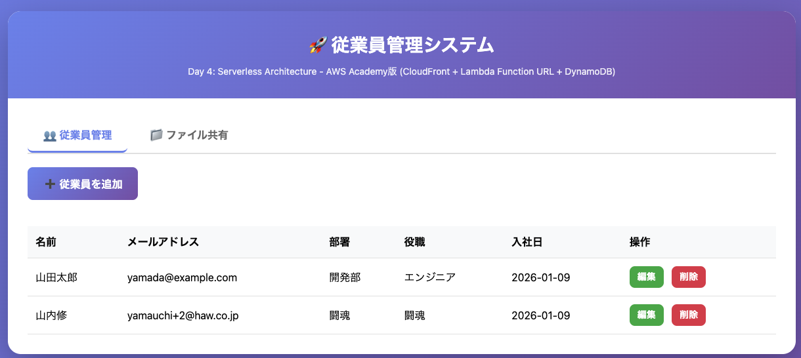
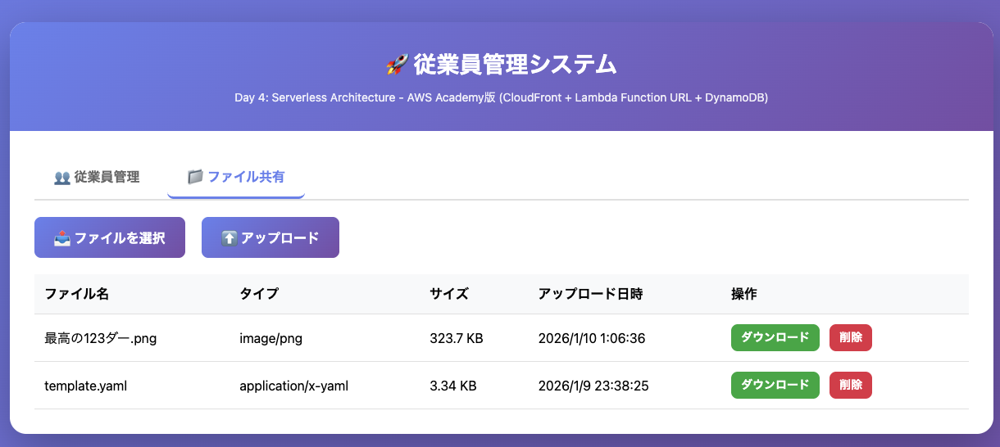
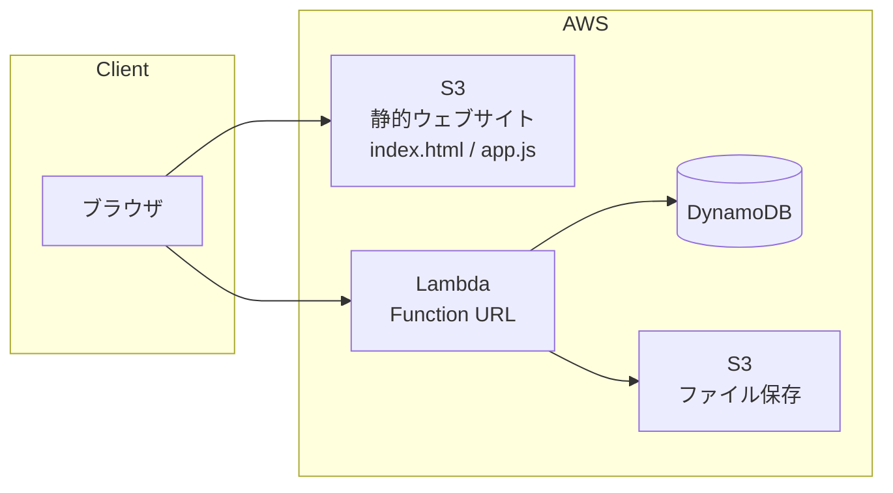
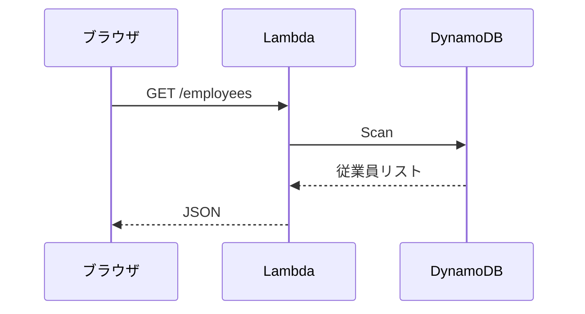
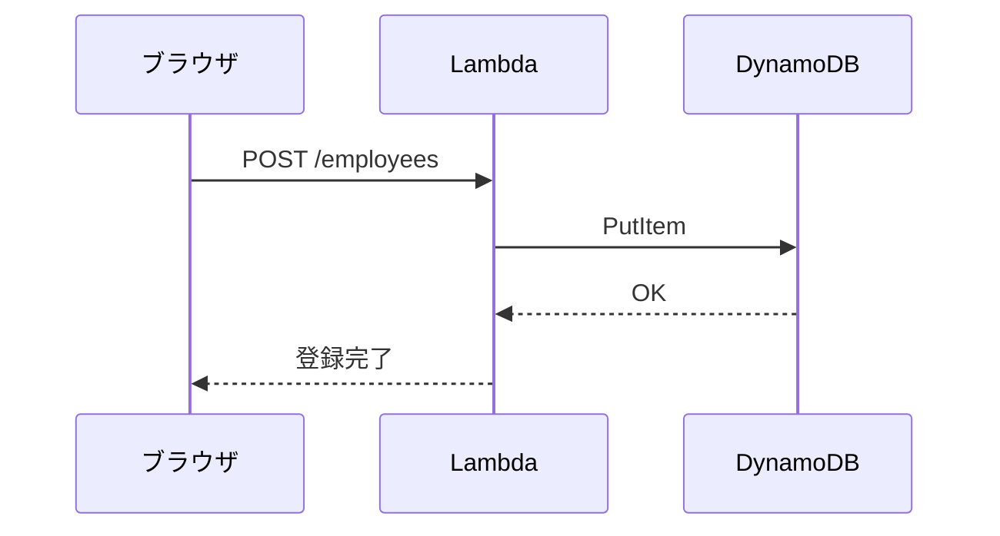
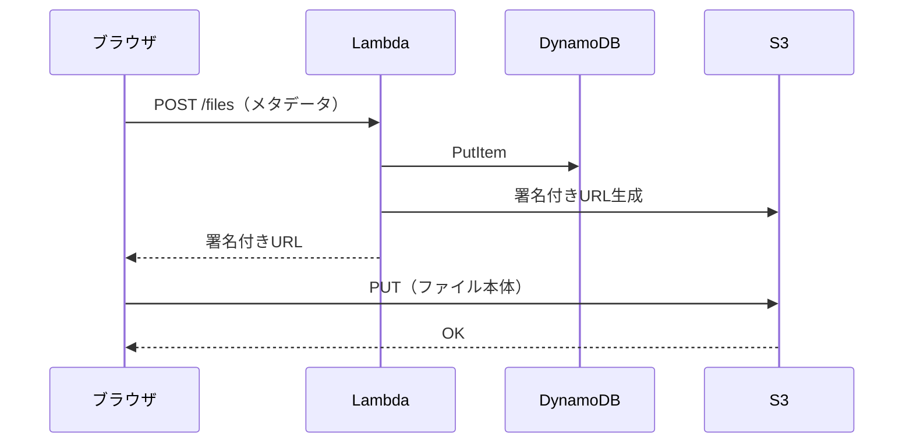
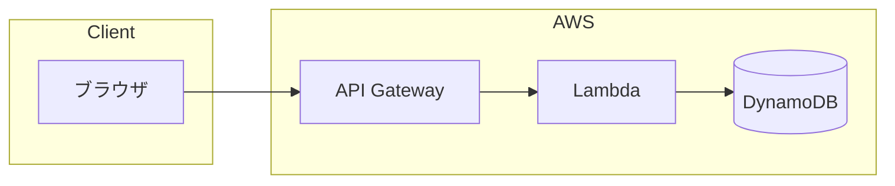
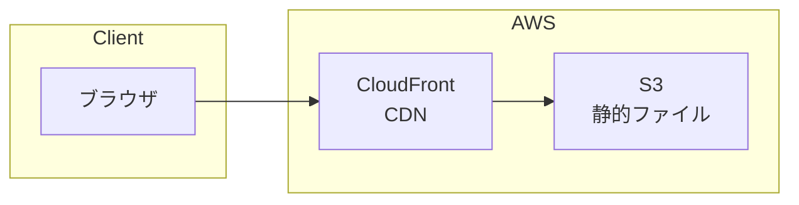
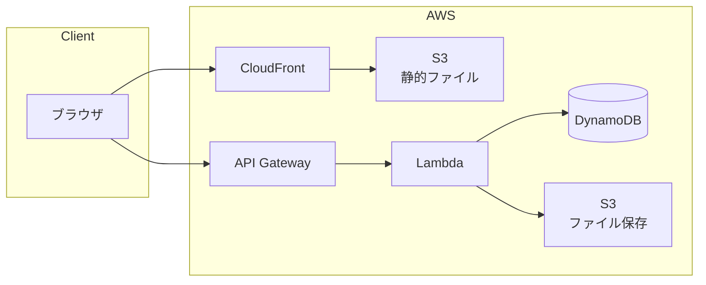

# Day4 CloudFormation ハンズオン（AWS Academy版）

## 概要

サーバーレスアーキテクチャ（Lambda Function URL + DynamoDB + S3）をCloudFormationでデプロイします。

---



---


---

## 使用するAWSサービス

### AWS Lambda
- サーバーレスの中核サービス
- サーバー管理不要、コードをアップロードするだけ
- 標準ランタイム: Node.js, Python, Java, Go, .NET など
- 実行した分だけ課金（リクエスト数 + 実行時間）
- 今回は Function URL でHTTPエンドポイントを公開

### Amazon DynamoDB
- フルマネージドNoSQLデータベース
- Key-Valueストア + ドキュメントDB
- 水平方向にスケール（データ量・リクエスト数に応じて自動拡張）
- ミリ秒単位のレイテンシ
- **プライマリキー**:
  - **パーティションキー（必須）**: データの分散先を決めるキー。同じ値は同じパーティションに格納
  - **ソートキー（オプション）**: パーティション内での並び順を決めるキー
- 今回は `id`（UUID）をパーティションキーとして使用（ソートキーなし）

### Amazon S3
- オブジェクトストレージ
- 99.999999999%（イレブンナイン）の耐久性
- 通常はプライベート（公開しない）
- 今回の用途:
  - **FilesBucket**: アップロードファイル保存（非公開、署名付きURLでアクセス）
  - **WebsiteBucket**: 静的ウェブサイトホスティング（フロントエンド公開用）

### AWS CloudFormation
- Infrastructure as Code（IaC）サービス
- YAMLまたはJSONでAWSリソースを定義
- テンプレートからスタック（リソースの集合）を作成
- 変更・削除もスタック単位で管理
- 今回は Lambda, DynamoDB, S3, IAMロールを一括デプロイ

## 構成図



## シーケンス図

### 従業員一覧取得（GET /employees）



### 従業員登録（POST /employees）



### ファイルアップロード



## 手順

### 事前準備

1. AWS Academy Learner Labを起動(Start Lab)し、「AWS🟢」ボタンでAWSコンソールを立ち上げる
2. リージョンが **us-east-1（バージニア北部）** であることを確認
3. LabRoleのARNを確認: IAMコンソール → ロール → `LabRole` → ARNをコピー
   - 形式: `arn:aws:iam::XXXXXXXXXXXX:role/LabRole`


### Step 1: S3バケット作成（Lambda用）

1. S3コンソールを開く
2. 「バケットを作成」をクリック
3. バケット名: `day4-lambda-YYYYMMDD-yourname`（例: `day4-lambda-20260109-taro`）
4. リージョン: us-east-1
5. 他はデフォルトのまま「バケットを作成」

### Step 2: [api.zip](https://github.com/haw/strong-system-dot-com/raw/main/docs/day4/cf/academy/api.zip)をアップロード

1. 作成したバケットを開く
2. 「アップロード」をクリック
3. [api.zip](https://github.com/haw/strong-system-dot-com/raw/main/docs/day4/cf/academy/api.zip) をアップロード (リンクをクリックするとPCにダウンロードされるはず。解凍はせずに`api.zip`のままアップロードする)

### Step 3: CloudFormationスタック作成

1. CloudFormationコンソールを開く
2. 「スタックの作成」→「新しいリソースを使用（標準）」
3. 「前提条件: 既存のテンプレートを選択」、「テンプレートの指定: テンプレートファイルのアップロード」を選択
4. [template.yaml](https://raw.githubusercontent.com/haw/strong-system-dot-com/main/docs/day4/cf/academy/template.yaml) をアップロード (リンクを右クリックで一度、PCにダウンロードし、ダウンロードしたものをAWSコンソールにアップロードする)
5. 「次へ」

### Step 4: パラメータ入力

- スタック名: `day4-stack`
- LabRoleArn: 事前準備でコピーしたLabRoleのARN
- LambdaCodeBucket: Step 1で作成したバケット名
- 「次へ」→「次へ」→「送信」

### Step 5: デプロイ完了を待つ

- ステータスが `CREATE_COMPLETE` になるまで待機（2〜3分）※ たまに更新🔄ボタンを押す
- 「出力」タブで以下を確認:
  - **FunctionUrl**: API エンドポイント
  - **WebsiteUrl**: フロントエンドURL
  - **WebsiteBucketName**: フロントエンドアップロード先

## 動作確認（API）

CloudShell（左下）で以下を実行（URLは「出力」タブの FunctionUrl に置き換え、末尾に `/employees` を追加）:

```bash
# 従業員一覧取得
curl https://xxxxxx.lambda-url.us-east-1.on.aws/employees

# 従業員登録
curl -X POST https://xxxxxx.lambda-url.us-east-1.on.aws/employees \
  -H "Content-Type: application/json" \
  -d '{"name": "山田太郎", "email": "yamada@example.com", "department": "開発部", "position": "エンジニア"}'

# 従業員一覧取得（登録確認）
curl https://xxxxxx.lambda-url.us-east-1.on.aws/employees
```

## フロントエンドのデプロイ

### Step 1: ファイルをダウンロード

以下のリンクから2つのファイルをダウンロード（リンクを右クリック →「リンク先を別名で保存...」）:
- [index.html](https://raw.githubusercontent.com/haw/strong-system-dot-com/main/docs/day4/cf/academy/frontend/index.html)
- [app.js](https://raw.githubusercontent.com/haw/strong-system-dot-com/main/docs/day4/cf/academy/frontend/app.js)

### Step 2: app.jsのAPI URL設定

ダウンロードした `app.js` の4行目を編集:

```javascript
// 変更前
const API_URL = 'FUNCTION_URL_PLACEHOLDER';

// 変更後（出力タブのFunctionUrlに置き換え、末尾のスラッシュは削除）
const API_URL = 'https://xxxxxx.lambda-url.us-east-1.on.aws';
```

### Step 3: フロントエンドをS3にアップロード

1. S3コンソールで **WebsiteBucketName** のバケット(`day4-website-xxxxx`のはず。※ xxxxxは人によって異なる)を開く
2. 「アップロード」をクリック
3. 以下をアップロード:
   - `index.html`（Step 1でダウンロードしたもの）
   - `app.js`（Step 2で編集したもの）

### Step 4: フロントエンド動作確認

1. 「出力」タブの **WebsiteUrl** にアクセス
2. 従業員の追加・編集・削除ができることを確認
3. ファイルのアップロード・ダウンロード・削除ができることを確認

## クリーンアップ

1. **S3バケットを空にする**（中身があるとスタック削除が失敗します）:
   - S3コンソールで `day4-website-XXXX` バケットを開く → 全選択 →「削除」
   - S3コンソールで `day4-files-XXXX` バケットを開く → 全選択 →「削除」

2. **CloudFormationスタックを削除**:
   - CloudFormationコンソールでスタックを選択 →「削除」

3. **api.zipを置いたS3バケットを削除**（任意）:
   - S3コンソールでバケットを空にして削除

## トラブルシューティング

### CREATE_FAILED になった場合

1. 「イベント」タブでエラー内容を確認
2. よくある原因:
   - LabRoleArnが間違っている
   - S3バケット名が間違っている
   - api.zipがアップロードされていない
   - リージョンがus-east-1以外

### CORSエラーが出る場合

- app.jsのAPI_URLが正しいか確認
- 末尾にスラッシュがないか確認（`https://xxx.on.aws` が正しい、`https://xxx.on.aws/` は間違い）

---

## 補足: 本番環境での構成

今回はAWS Academy Learner Labの制約により簡易構成としましたが、本番環境では以下のサービスを追加するのが一般的です。

### API Gateway + Lambda 構成



**API Gatewayのメリット:**
- レート制限（スロットリング）
- APIキー管理
- リクエスト/レスポンスの変換
- カスタムドメイン対応
- ステージ管理（dev/staging/prod）

**今回の構成（Lambda Function URL）との違い:**
- Function URLは最小構成で手軽だが、上記機能がない
- 学習用・プロトタイプには十分、本番では要検討

### CloudFront + S3 構成



**CloudFrontのメリット:**
- エッジロケーションからの配信（低遅延）
- HTTPS対応（カスタムドメイン + SSL証明書）
- キャッシュによる負荷軽減
- DDoS対策（AWS Shield統合）

**今回の構成（S3 Website Hosting）との違い:**
- S3単体ではHTTPのみ（HTTPSはCloudFront経由が必要）
- グローバル配信にはCloudFrontが必須

### 本番構成の全体像



#### 参考： ハンズオンの構成図


今回のハンズオンで学んだ Lambda + DynamoDB + S3 の基本構成は、本番環境でもそのまま活きます。API GatewayやCloudFrontは「追加のレイヤー」として理解してください。
