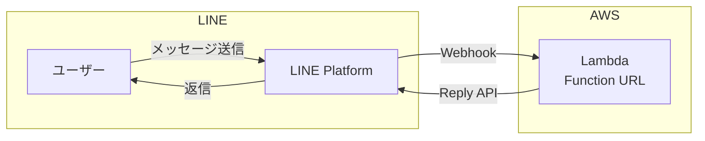
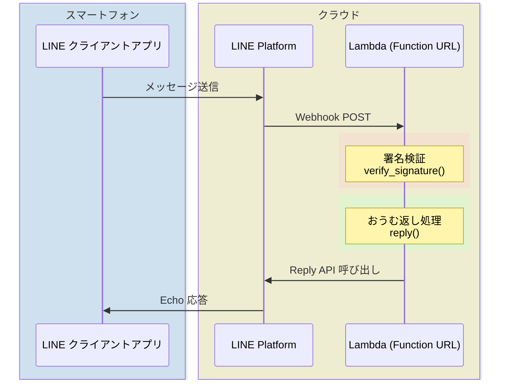

# LINE おうむ返しBot ハンズオン（AWS Academy版）

## 概要

Lambda + Function URL で LINE Bot を作成します。外部ライブラリ不要、Python標準ライブラリのみで実装します。

**対象**: 
- AWS Academy の環境を利用できる方（本手順はIAMロール `LabRole` を使用）
- 通常のAWS環境の場合: Lambdaの基本実行ロール（`AWSLambdaBasicExecutionRole`）があれば動作します。Lambda作成時に「基本的なLambdaアクセス権限で新しいロールを作成」を選択すればOKです

**位置づけ**: Day4 CloudFormationハンズオンを早く終わった方向けの追加課題

## 構成図



## シーケンス図



## 使用するAWSサービス

### AWS Lambda
- サーバーレスでコード実行
- Function URL でHTTPエンドポイントを公開
- 今回はPython 3.14を使用

## LINE公式アカウント（Messaging API チャネル）の作成

### チャネルシークレット と チャネルアクセストークン

LINE Developers で Messaging API チャネルを作成し、以下の2つを取得します。

- **チャネルシークレット**: LINEプラットフォームと開発者の間だけで共有する秘密の値。Webhookリクエストが本当にLINEプラットフォームから来たものかを検証するために使用
- **チャネルアクセストークン（長期）**: チャネルに対してメッセージを送信するための認証トークン。Reply APIを呼び出す際に必要

詳細な手順は公式ドキュメントをご参照ください。

- [Messaging APIを始めよう](https://developers.line.biz/ja/docs/messaging-api/getting-started/)

上から順に「2-3」まで進めてください。

### LINE公式アカウントの設定

次に以下の手順を参考に、［あいさつメッセージ］や［応答メッセージ］の設定を［オフ］にしておいてください。

- [LINE Official Account Managerでの設定](https://developers.line.biz/ja/docs/messaging-api/building-bot/#line-manager-settings)

## Lambda関数の作成

### Step 1: Lambda関数を作成

1. Lambdaコンソールを開く
2. 「関数の作成」をクリック
3. 以下を設定:
   - 関数名: `line-echo-bot`
   - ランタイム: Python 3.14
   - アーキテクチャ: x86_64
   - デフォルトの実行ロールの変更: 
     - AWS Academy: 「既存のロールを使用する」→ `LabRole`
     - 通常環境: 「基本的なLambdaアクセス権限で新しいロールを作成」
   - その他の設定
     - 「ネットワーキング > 関数 URL」を有効化
        - 認証タイプ: NONE
        - 呼び出しモード: BUFFERED (デフォルト)
     - その他の設定は、デフォルト値のまま
4. 「関数の作成」をクリック

### Step 2: 環境変数を設定

1. 「設定」タブ →「環境変数」→「編集」
2. 以下を追加:
   - キー: `LINE_CHANNEL_ACCESS_TOKEN`
   - 値: [上記で取得した](#チャネルシークレット-と-チャネルアクセストークン)チャネルアクセストークン (「Messaging API設定」 タブの一番下)
   - キー: `LINE_CHANNEL_SECRET`
   - 値: [上記で取得した](#チャネルシークレット-と-チャネルアクセストークン)チャネルシークレット(「チャネル基本設定」 タブの下方)
3. 「保存」

### Step 3: コードを貼り付け

「コード」タブで `lambda_function.py` を以下に置き換え（あらかじめ書いてあるコードを全部上書きしてよい）:

```python
import json
import os
import urllib.request
import hashlib
import hmac
import base64

LINE_CHANNEL_ACCESS_TOKEN = os.environ['LINE_CHANNEL_ACCESS_TOKEN']
LINE_CHANNEL_SECRET = os.environ['LINE_CHANNEL_SECRET']

def lambda_handler(event, context):
    # 署名検証
    signature = event['headers'].get('x-line-signature', '')
    body = event['body']
    
    if not verify_signature(body, signature):
        return {'statusCode': 403, 'body': 'Invalid signature'}
    
    body_json = json.loads(body)
    
    for e in body_json['events']:
        if e['type'] == 'message' and e['message']['type'] == 'text':
            reply_token = e['replyToken']
            text = e['message']['text']
            reply(reply_token, text)
    
    return {'statusCode': 200, 'body': 'OK'}

def verify_signature(body, signature):
    hash = hmac.new(
        LINE_CHANNEL_SECRET.encode('utf-8'),
        body.encode('utf-8'),
        hashlib.sha256
    ).digest()
    expected_signature = base64.b64encode(hash).decode('utf-8')
    return hmac.compare_digest(signature, expected_signature)

def reply(token, text):
    url = 'https://api.line.me/v2/bot/message/reply'
    headers = {
        'Content-Type': 'application/json',
        'Authorization': f'Bearer {LINE_CHANNEL_ACCESS_TOKEN}'
    }
    data = json.dumps({
        'replyToken': token,
        'messages': [{'type': 'text', 'text': text}]
    }).encode()
    
    req = urllib.request.Request(url, data=data, headers=headers)
    urllib.request.urlopen(req)
```

4. 「Deploy」をクリック

### Step 4: 関数 URLをコピー

「関数 URL」をコピーする。

---

もし、「[Step 1: Lambda関数を作成](#step-1-lambda関数を作成)」で設定をしていない場合は、下記の手順で有効化して、「関数 URL」をコピーする。

1. 「設定」タブ →「関数 URL」→「関数 URLを作成」
2. 認証タイプ: `NONE`（LINEからのWebhookを受けるため）
3. 「保存」
4. 表示された「関数 URL」をコピー

---

## LINE Webhook設定

1. Lambda関数URLをそのまま使用（例：`https://xxxxxxxxxx.lambda-url.us-east-1.on.aws/`）
2. LINE Developers の「Webhook URL」に貼り付け (「Messaging API設定」タブ)
3. 「Use webhook」を ON にして 「検証（Verify）」 をクリック

## 動作確認

1. LINEで作成したBotを友だち追加
2. メッセージを送信 (テキストメッセージ)
3. 同じメッセージが返ってくれば成功！

## トラブルシューティング

### 返信が来ない場合

1. CloudWatch Logsでエラーを確認:
   - Lambdaコンソール →「モニタリング」→「CloudWatch Logsを表示」
2. よくある原因:
   - `LINE_CHANNEL_ACCESS_TOKEN` が間違っている
   - Webhook URLが間違っている
   - Webhook検証が有効になっている（無効にする）

### 署名検証について

コード内の `verify_signature` 関数で、LINEプラットフォームからのリクエストであることを検証しています。これにより第三者からの不正なリクエストを防ぎます。

## 発展課題

時間が余った方は以下に挑戦してみてください:

- 特定のキーワードに反応する（例: 「こんにちは」→「こんにちは！元気ですか？」）
- 現在時刻を返す（例: 「今何時？」→「14:30です」）
- じゃんけんBot（例: 「グー」→ランダムで勝負）

参考: [カスタマイズ集](https://qiita.com/torifukukaiou/items/822bec463a6ff418ad2b#4-%E3%81%8A%E3%81%86%E3%82%80%E8%BF%94%E3%81%97%E3%82%AB%E3%82%B9%E3%82%BF%E3%83%9E%E3%82%A4%E3%82%BA%E9%9B%86)

## クリーンアップ

1. Lambdaコンソールで `line-echo-bot` 関数を削除

---

## 講師向けメモ

- AWS Academy Learner Lab で動作確認済（2026-01-15）
- AWS Cloud Foundations サンドボックスで動作確認済（2026-01-15）