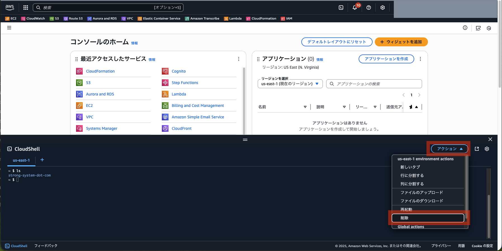

# Day 5: Kiro CLI による Vibe Coding 体験（クイックスタート版）

## 目標

- Kiro CLIをセットアップし、AIとの対話でコーディング
- プロンプトエンジニアリングの基礎を体験
- S3静的ウェブサイトホスティングの実践
- AWS CLIとKiro CLIの連携を理解

## 所要時間

約40分

---

## 前提条件

- IAMユーザーに以下の権限が付与されていること：
  - `PowerUserAccess`
  - `IAMFullAccess`
- AWS Builder IDアカウント（無料）
  - 持っていない場合は事前に作成してください
  - https://docs.aws.amazon.com/ja_jp/signin/latest/userguide/sign-in-aws_builder_id.html

---

## Day 5の構成

Day 5では、EC2上でKiro CLIを使用してAIとの対話でウェブサイトを構築します：

```
EC2インスタンス:
├── Ubuntu 24.04
├── Kiro CLI ← AIアシスタント
└── AWS CLI ← S3へのデプロイ

Amazon S3:
└── 静的ウェブサイトホスティング
    ├── index.html
    ├── style.css
    └── script.js
```

---

## 手順

### 0. AWS Builder IDにログインする
[https://profile.aws.amazon.com/](https://profile.aws.amazon.com/)

- ※ IAMユーザーとは別のアカウント
- AWS Builder IDを持っていない場合は、画面の指示に従って取得を進める
- 「8.1 Kiro CLIにログイン」で必要になる

### 1. CloudShellを起動

> **重要**: CloudShellを起動する前に、基本的に **東京リージョン（ap-northeast-1）** を選択してください。  
> ただし、CloudShellの同時接続数が10（デフォルト）、リージョンごとのVPCの上限が5（デフォルト）などの制限がありますので、同時に実施する場合はリージョンの割り振りを行います。  

1. AWSマネジメントコンソールにログイン
2. **画面右上のリージョン選択**で「**アジアパシフィック（東京）ap-northeast-1**」を選択（※ **割り振られたリージョンを選択**）
3. **画面左下のCloudShellアイコン**（ターミナルのようなアイコン）をクリック
4. CloudShellが起動するまで待つ（初回は1-2分）

もし、`ls`をして前回の`strong-system-dot-com`などのディレクトリが残っているようであれば、一度CloudShellを消して、立ち上げ直してください（下記図参照）。(ディスク容量不足が発生する場合があるため)  




---

### 2. Node.js 22のセットアップ

```bash
# nvmのインストール
curl -o- https://raw.githubusercontent.com/nvm-sh/nvm/v0.40.3/install.sh | bash
source ~/.bashrc

# Node.js 22のインストール
nvm install 22
nvm use 22
node -v  # v22.x.x と表示されることを確認
```

---

### 3. リポジトリのクローンとセットアップ

```bash
cd ~
git clone https://github.com/haw/strong-system-dot-com.git
cd strong-system-dot-com/docs/day5/cdk
npm install
```

---

### 4. CDK環境のBootstrap（初回のみ）

```bash
npx cdk bootstrap -c userName={あなたの名前} --verbose
```

- 例: `npx cdk bootstrap -c userName=tanaka --verbose`
- `userName`の値は**半角英字のみ**を使用してください  
- 既にbootstrap済みの場合は「bootstrapped (no changes).」と表示されます

---

### 5. EC2環境をCDKでデプロイ

1. CDKデプロイを実行：

    ```bash
    npx cdk deploy -c userName={あなたの名前} --verbose
    ```

    例: `npx cdk deploy -c userName=tanaka --verbose`

2. デプロイ確認プロンプトで `y` を入力

3. デプロイ完了まで待つ（約5-10分）

4. デプロイ完了後、Outputsに表示される情報を確認：
    - InstanceId

    ※ 以下のようなを出力を確認したら、CloudShellは一旦、閉じておいてよい（CloudShell内右上の☓）。

    

5. EC2インスタンスのセットアップが完了するまで待つ（約3-5分）
    - EC2インスタンスの一覧で「ステータスチェック」が完了するのを待つ

---

### 6. EC2インスタンスに接続

1. AWSマネジメントコンソールでEC2サービスを開く

2. インスタンス一覧から **`kiro-cli-{あなたの名前}`** を選択

3. **「接続」** ボタンをクリック

4. **「セッションマネージャー」** タブを選択

5. **「接続」** ボタンをクリック

    

6. ブラウザ内でターミナルが開きます

---

### 7. Ubuntuユーザーに切り替え

```bash
sudo su - ubuntu
cd ~
```

---

### 8. Kiro CLIのセットアップ

#### 8.1 Kiro CLIにログイン

```bash
kiro-cli login --use-device-flow
```

#### 8.2 認証フローの実行


1. **「Use with Builder ID」** を選択（エンター）
2. 認証用のURLが払い出されるため、コピーして別タブで開く（必要に応じて、AWS Builder IDでサインインする）
    
3. 画面の指示に従って、認証フローを実行する（「**確認して続行**」）
    
4. 画面の指示に従って、認証フローを実行する（「**アクセスを許可**」）
    
5. リクエストが承認されるはず（画面の案内の通り、認証に使用したタブは閉じてよい）
    
6. セッションマネージャーにもどると、 **Device authorized** されているはず
    

おめでとうございます🎉🎉🎉  
準備は整いました。  

---

### 9. Vibe Coding: AIとの対話でウェブサイト構築

#### 9.1 Kiro CLI Chatを起動

```bash
kiro-cli chat
```

#### 9.2 Tips

- `/usage`コマンドで、Kiro CLIの残使用量を見ることができます。ハンズオンのプロンプト例(9.3)をモデルでデフォルトの`Auto (current)`で一回流して、`y`を複数回押したとして、だいたい1 credit未満です(無料プランでは、月50 creditsまで使えます。初回利用時にはボーナスクレジットをもらえる場合があります)
- より賢いモデルを使いたい: `/model` でモデル切り替えができます。2025/12/08現在、使用できる最高のモデルは、`claude-opus-4.5`です。デフォルトと比べ2.2倍のクレジットを消費するようです。アカウントごとに選べるモデルが異なるようで、`claude-opus-4.5`が選択できない場合があるかもしれません。本ハンズオンではどのモデルをお使いいただいても最後まで進めることができます。迷ったら、`Auto (current)`のままにしておいてください。
- Kiro CLIとのチャットではなくコマンドを実行したい: `!` に続けてください。例 `! cat index.html`
- プロンプトを打ち込むときに改行したい: Ctl + J です
- 離席などしてセッションマネージャーの接続がきれた。再開したい: そんなときはさきほどKiro CLIを起動した同じディレクトリで、`kiro-cli chat --resume`です
- Kiro CLIのヘルプをみたい: `/help`です
- Kiro CLIを終わりたい: `/quit`です

#### 9.3 プロンプト例

以下のプロンプトをKiro CLIに入力してください：

```
「ようこそ [あなたの名前] のページへ」というタイトルで、自己紹介ページを作成してください。
私の名前は [あなたの名前] 、会社は [あなたの会社名]、住んでいる場所は[あなたの住所]です。
 [あなたの地域の特徴] な土地です。
会社の横には [適当な画像のURL] の写真を掲載してください。
これをバージニア北部リージョン（us-east-1） のAmazon S3バケットにindex.htmlとして配置し、
ウェブサイトホスティング機能を有効にして、一般公開してください。
HTML以外にCSSやJSファイルを作成していただいてもかまいません。
バケット名は [yourname] に続けて今日の日付を8桁 + ランダムな文字列10桁で設定してください。
サイト訪問者を楽しませるため [テトリス] を実装してください。
```

**アレンジが必要な箇所**:
- **[あなたの名前]**: 例: 山内修
- **[あなたの会社名]**: 例: ストロングシステム
- **[あなたの住所]**: 例: 福岡県飯塚市
- **[あなたの地域の特徴]**: 例: 山と川に囲まれた自然豊かな
- **[適当な画像のURL]**: 例: https://www.haw.co.jp/wp-content/uploads/2019/06/haw_logo_2019_06.png
- **[yourname]**: 例:  yamauchi (S3バケットにつける名前)
- **[テトリス]**: 他のゲームでもOK（例: スネークゲーム、ブロック崩しなど。まずは有名なゲームのほうが無難）

#### 9.4 AIとの対話

1. Kiro CLIがコードを生成します
2. 提案された内容を確認
3. 必要に応じて修正を依頼
4. AWS CLIコマンドが提案されたら実行を承認(`y`)

#### 9.5 ウェブサイトの確認

1. Kiro CLIが出力するS3ウェブサイトURLをコピー
2. ブラウザで開いて動作確認
3. 自己紹介ページとテトリスなどのゲームが表示されることを確認


#### 完成例


---

### 10. 追加の改善（オプション）

Kiro CLIとの対話で以下のような改善を試してみましょう：

```
デザインをもっとモダンにしてください
```

```
レスポンシブデザインに対応してください
```

```
ありがとうございます。いいサイトができました。もっとモダンで刺激的なサイトに作り変えてください。
```

> 💡**任意**: ここまでできたら、サイトのURLとスクリーンショットをチャットに投稿してください。  

#### 改善例


---

### 11. リソースの削除

研修終了後、 **CloudShell** (⚠️ セッションマネージャーではない)で以下のコマンドでリソースを削除してください：  

CloudShellを再起動した際に、CloudShell内をクリックする必要がある場合があります。表示されるメッセージの指示に従ってください。

```bash
cd ~/strong-system-dot-com/docs/day5/cdk
npx cdk destroy -c userName={あなたの名前} --verbose
```

削除確認があるので、 **`y` + Enter でスタックの削除** が開始される。  

> **Note**: リソースの削除には5-10分かかります。

#### S3バケットの削除

**ハンズオンで作成した.html、.js、.css等を保存しておきたい場合は削除する前に、ダウンロードしておいてください。**  

Kiro CLIで作成したS3バケットは手動で削除する必要があります：

1. AWSマネジメントコンソールでS3サービスを開く
2. **バージニア北部リージョン（us-east-1）** に切り替え
3. `yourname{日付}{ランダム文字列}` バケットを選択
4. 「空にする」をクリック
5. 「削除」をクリック

---

## 学んだこと

### 1. Kiro CLI
- AIとの対話でコーディング
- プロンプトエンジニアリングの基礎
- AWS CLIとの連携

### 2. S3静的ウェブサイトホスティング
- バケットポリシーの設定
- ウェブサイトホスティングの有効化
- パブリックアクセスの設定

### 3. プロンプトエンジニアリング
- 具体的な指示の重要性
- 段階的な改善の方法
- AIとの効果的な対話

---

## トラブルシューティング

### Kiro CLIのログインができない

- AWS Builder IDのアカウントを確認
- デバイスコードの有効期限（15分）を確認
- ブラウザのキャッシュをクリア

### S3バケットの作成に失敗する

- バケット名が既に使用されている可能性
- リージョンが正しいか確認（us-east-1）
- IAM権限を確認

### ウェブサイトが表示されない

- バケットポリシーが正しく設定されているか確認
- ウェブサイトホスティングが有効になっているか確認
- index.htmlが正しくアップロードされているか確認

---

## 次のステップ

- Kiro CLIで他のAWSサービスを試す
- より複雑なウェブアプリケーションを構築
- CI/CDパイプラインの構築を学ぶ
