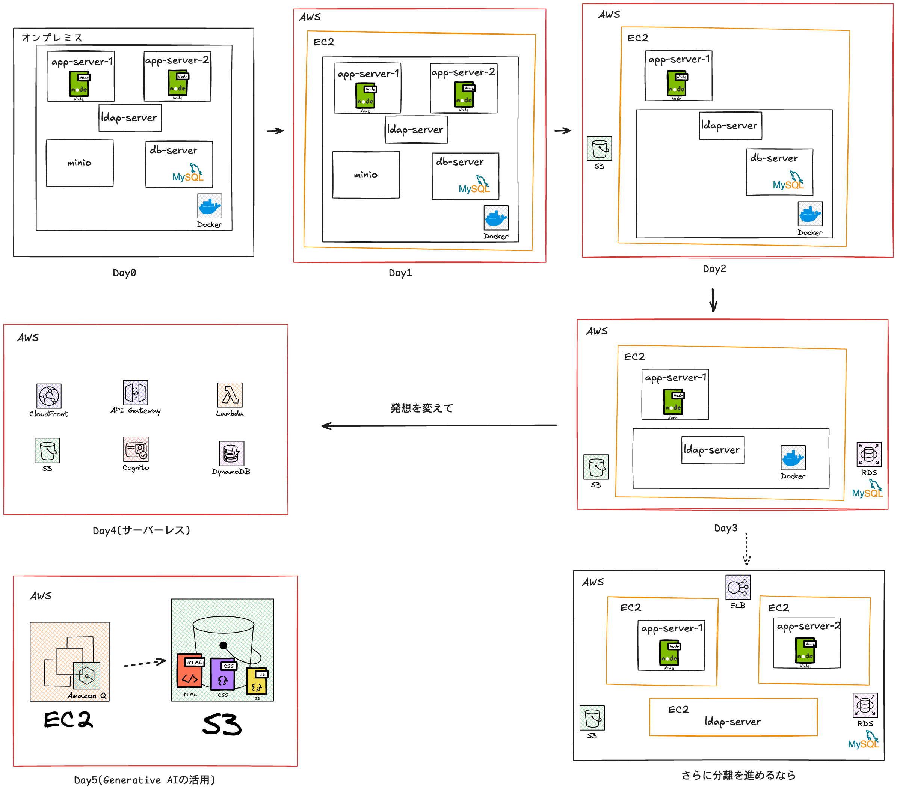

# AWS実践研修プログラム

全5回で、Dockerで構築したシステムをオンプレミスに構築されているものとみなして、徐々にクラウドへ移行していきます。

## 研修内容

### [Day 1: オンプレミス環境をクラウドへ](./day1/)
- VPC、EC2、セキュリティグループの基本
- Dockerコンテナをクラウドで動かす
- 伝統的な3層アーキテクチャ

### [Day 2: ストレージのクラウド化](./day2/)
- MinIOからS3への移行
- CloudFrontとの連携
- オブジェクトストレージの活用

### [Day 3: データベースのマネージド化](./day3/)
- MySQLコンテナからRDSへの移行
- マネージドサービスのメリット
- バックアップ・復旧

### [Day 4: サーバーレスアーキテクチャ](./day4/)
- CloudFront + S3 + Lambda + DynamoDB + Cognito
- クラウドネイティブへの振り切り
- 運用コストと可用性の比較

### [Day 5: Kiro CLI（旧Amazon Q Developer CLI）](./day5/)
- 生成AI入門
- AI開発支援の体験

---

## 研修の特徴

- **各回1時間**: 講義15分、ハンズオン30分、質疑応答10分、後片付け5分
- **段階的移行**: Day 1-3で伝統的構成、Day 4でクラウドネイティブ
- **実践重視**: 動くものを作る体験を重視

## 注意事項

- 共有AWSアカウントを使用します
- すべてのリソース名に `-{あなたの名前}` を付けてください
- 各回終了後、リソースを削除してください
